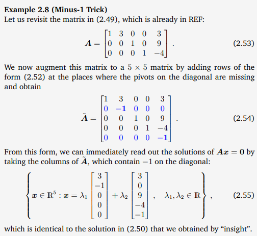

# Mathmatics for Machine Learning

## Chapter 02 Linear Algebra
- ***algebra***
  - When formalizing intuitive concepts, a common approach is to construct 
    - a set of objects (symbols) 
    - and a set of rules to manipulate these objects. 
  - This is known as an algebra.
- Linear algebra is the study of **vectors** and certain **algebra rules** to manipulate vectors.
  - In general, vectors are special objects that can be 
    - added together 
    - and multiplied by scalars 
  - to produce another object of the same kind. 

### 2.1 Systems of Linear Equations
- the general form of a system of linear equations
  - $$\begin{align}a_{11}x_1 + \cdots + a_{1n}x_n&= b_1 \\ \dots \\ a_{m1}x_1 + \cdots + a_{mn}x_n &= b_m \end{align}$$
  - $x_1, . . . , x_n$ are the ***unknowns*** of this system
  - Every **n-tuple** $(x_1, . . . , x_n) ∈ R^n$ that satisfies it is a ***solution*** of the linear equation system.
- In general, for a **real-valued system** of linear equations we obtain either
  - **no**, 
  - **exactly one**, 
  - or **infinitely many** solutions.

### 2.2 Matrices
- . They can be used to compactly represent 
  - **systems of linear equations**, 
  - and **linear functions** **(linear mappings)**
- ***Matrix*** 
  - **Definition 2.1 (Matrix).** With $m, n ∈ N$ a real-valued $(m, n)$ 
  - ***matrix*** $A$ is an $m·n$-tuple of elements $a_{ij} , i = 1, . . . , m, j = 1, . . . , n$, 
    - which is ordered according to a rectangular scheme consisting of m rows and n columns: $$A= \begin{bmatrix}a_{11}&a_{12}&\cdots &a_{1n} \\ a_{21}&a_{22}&\cdots &a_{2n} \\ \vdots & \vdots &\ddots &\vdots \\ a_{m1}&a_{m2}&\cdots &a_{mn} \end{bmatrix}, a_{ij}\in R$$
  - By convention 
    - $(1, n)$-matrices are called ***rows*** 
    - $(m, 1)$-matrices are called ***columns***. 
    - These special matrices are also called ***row/column vectors***.
- $R^{m\times n}$ is the set of all real-valued (m, n)-matrices.
- $A ∈ R^{m\times n}$ can be equivalently represented as $a ∈ R^{mn}$ by stacking all $n$ columns of the matrix into a long vector; 

#### 2.2.1 Matrix Addition and Multiplication
- ***Addition***
  - The sum of two matrices $A ∈ R^{m\times n} , B ∈ R^{m\times n}$ is defined as the element-wise sum $$A+b\coloneqq \begin{bmatrix}a_{11}+b_{11}&\cdots &a_{1n}+b_{1n}\\ \vdots &\ddots &\vdots \\ a_{m1}+b_{m1}&\cdots &a_{mn}+b_{mn}\end{bmatrix} \in R^{m\times n}$$
- ***Multiplication*** 
    - For matrices $A ∈ R^{m\times n}, B ∈ R^{n\times k}$ , the elements $c_{ij}$ of the product $C = AB ∈ R^{m\times k}$ are computed as $$c_{ij}=\sum^{n}_{l=1}a_{il}b_{lj}, \\ i=1,\dots,m \\ j=1,\dots,k$$
- ***Identity Matrix*** **Definition 2.2 (Identity Matrix).**
- properties
  - ***Associativity***:
    - $\forall A ∈ R^{m\times n}, B ∈ R^{n\times p}, C ∈ R^{p\times q}: (AB)C = A(BC)$
  - ***Distributivity***
    - $$\begin{aligned}∀A, B ∈ R^{m×n}, C, D ∈ R^{n×p}: (A + B)C &= AC + BC \\A(C + D) &= AC + AD \end{aligned}$$
  - ***Multiplication with the identity matrix***:
    - $∀A ∈ R^{m\times n}: I_mA = AI_n = A$
    - Note that $I_m \neq I_n$ for $m \neq n$

#### 2.2.2 Inverse and Transpose
- ***Inverse***
  - **Definition 2.3** (Inverse). Consider a square matrix $A ∈ R^{n×n} B ∈ R^{n×n}$ have the property that $AB = I_n = BA$. $B$ is called the ***inverse*** of $A$ and denoted by $A^{−1}$
  -  If this **inverse exist**, $A$ is called *regular/invertible/nonsingular*, **otherwise** *singular/noninvertible*. 
  - When the matrix inverse exists, it is **unique**
- ***Transpose***
  - **Definition 2.4 (Transpose).** For $A ∈ R^{m×n}$ the matrix $B ∈ R^{n×m}$ with $b_{ij} = a_{ji}$ is called the ***transpose*** of $A$. We write $B = A^{T}$.
- **The following are important properties of inverses and transposes:**
  - $$\begin{aligned}
    AA^{-1}&=I=A^{-1}A \\ (AB)^{-1}&=B^{-1}A^{-1}\\ (A+B)^{-1}&\neq 1A^{-1}+B^{-1}\\ (A^T)^T &= A \\ (A+B)^T &= A^T+B^T \\ (AB)^T &= B^TA^T\end{aligned}$$
- ***Symmetric Matrix***
  - **Definition 2.5 (Symmetric Matrix).** A matrix $A ∈ R^{n×n}$ is symmetric if symmetric matrix $A = A^T$

#### 2.2.3 Multiplication by a Scalar
- Let $A ∈ R^{m×n}$ and $λ ∈ R$. Then $λA = K$, $K_{ij} = λ a_{ij}$ .
- Practically, $λ$ scales each element of $A$. For $λ, ψ ∈ R$, the following holds:
  - Associativity:
    - $(λψ)C = λ(ψC)$, $C ∈ R^{m×n}$
  - Distributivity:
    - $(λ + ψ)C = λC + ψC$, $C ∈ R^{m×n}$
    - $λ(B + C) = λB + λC$, $B, C ∈ R^{m×n}$
  - $λ(BC) = (λB)C = B(λC) = (BC)λ$
  - $(\lambda C)^T=C^T\lambda^T=C^T\lambda=\lambda C^T$, since $\lambda = \lambda ^T$

#### 2.2.4 Compact Representations of Systems of Linear Equations
- Generally, a **system of linear equations** can be compactly represented in their matrix form as $Ax = b$
  - the product $Ax$ is **a (linear) combination** of the **columns of A**.

### 2.3 Solving Systems of Linear Equations

#### 2.3.1 Particular and General Solution 
- The general approach we followed consisted of the following 3 steps:
  1. Find a **particular solution** to $Ax = b$.
  2. Find **all solutions** to $Ax = 0$.
  3. Combine the solutions from steps 1. and 2. to the general solution.
- ***Gaussian elimination***

#### 2.3.2 Elementary Transformations
- ***elementary transformations***
  - **Exchange** of two equations (**rows**)
  - **Multiplication** of an equation (**row**) with a **constant** $λ ∈ R \backslash \{0\}$
  - **Addition** of two equations (**rows**)
- ***Pivots and Staircase Structure***
  - The leading coefficient of a row (first nonzero number from the left) is called the pivot and is always strictly to the right of the pivot of the row above it
- ***Row-Echelon Form REF*** 
  - **Definition 2.6 (Row-Echelon Form)**. A matrix is in row-echelon form if:
    - All rows that contain **only zero**s are at the bottom of the matrix;
    - Looking at nonzero rows only, the first nonzero number from the left (also called the pivot or the leading coefficient) is always strictly to the right of the pivot of the row above it.
- ***Basic and Free Variables***
  - The variables corresponding to the **pivots** in the row-echelon form are called ***basic variables***
  - the other variables are ***free variables***
- ***Reduced Row Echelon Form***
  - An equation system is in ***reduced row-echelon form*** (also: row-reduced echelon form or row canonical form) if
    - It is in row-echelon form.
    - Every pivot is 1.
    - The pivot is the **only** nonzero entry in its **column**

#### 2.3.3 The Minus-1 Trick
- We extend the matrix $A$ to an $n × n$-matrix $A˜$ by adding $n − k$ rows of the form $\begin{bmatrix}0 &\cdots &0 &-1 &0 &\cdots &0\end{bmatrix}$
  - 本质上就是把每个没有pivot的x设为-1

##### Calculating the Inverse
- To compute the inverse $A^{−1}$ of $A ∈ R^{n\times n}$, we need to find a matrix $X$ that satisfies $AX = I_n$. Then, $X = A^{−1}$.
  - 本质上就是解方程，所以可以使用初等行变换
- using *augmented matrix notation*
  - $[A|I_n] \rightarrowtail \cdots \rightarrowtail [I_n|A^{-1}]$

#### 2.3.4 Algorithms for Solving a System of Linear Equations
- Should there be no solution, we need to resort to **approximate solutions**
- $Ax = b \rightarrow x = A^{−1}b$
  - this is only possible if $A$ is a **square matrix and invertible**
-  Otherwise, under mild assumptions (i.e., $A$ needs to have **linearly independent** columns)
   -  $Ax=b \iff A^{T}Ax = A^{T}b \iff x = (A^{T}A)^{-1}A^{T}b$
   -  ***Moore-Penrose pseudo-inverse*** $(A^{T}A)^{-1}A^{T}$
   -  also corresponds to the minimum norm least-squares solution
   -  requires many computations for the **matrix-matrix product** and computing the **inverse** of $A^{T}A$.
- **Gaussian elimination** plays an important role
  -  However, for systems with millions of variables, it is **impractical** as the required number of arithmetic operations scales **cubically**
- In practice, systems of many linear equations are **solved indirectly**
  - Richardson method 
  - Gauß-Seidel method
  - successive over-relaxation method
  - or Krylov subspace methods
    - conjugate gradients
    - biconjugate gradients
    - generalized minimal residual
  - using **norms** $||\cdot||$ to compute similarities between results and expected results

### 2.4 Vector Spaces

#### 2.4.1 Groups
- ***Group Consider*** a set $\mathcal{G} $ and an operation $⊗$ : $\mathcal{G}  \times \mathcal{G}  → \mathcal{G}$ defined on $\mathcal{G}$. Then $G := (\mathcal{G} , ⊗)$ is called a ***group*** if the following hold:
  - Closure of $\mathcal{G}$ under $⊗$: $∀x, y ∈ \mathcal{G} : x ⊗ y ∈ \mathcal{G}$ 
  - Associativity: $∀x, y, z ∈ \mathcal{G} : (x ⊗ y) ⊗ z = x ⊗ (y ⊗ z)$
  - Neutral element: $∃e ∈ \mathcal{G}, ∀x ∈ \mathcal{G} : x ⊗ e = x$ and $e ⊗ x = x$
  - Inverse element: $∀x ∈ \mathcal{G}, ∃y ∈ \mathcal{G} : x ⊗ y = e$ and $y ⊗ x = e$,
    - $e$ is the neutral element 类似1
    - often write $x^{−1}$ to denote
    - 逆不一定是$\frac{1}{x}$，而是根据$⊗$而定的
- ***Abelian group (commutative)*** If additionally $∀x, y ∈ \mathcal{G} : x ⊗ y = y ⊗ x$, then $G = (\mathcal{G}, ⊗)$ is an **Abelian group (commutative)**
- ***General Linear Group*** The set of regular (invertible) matrices $A ∈ R^{n×n}$ is a **group** with respect to **matrix multiplication** and is called **general linear group** $GL(n, R)$
  - not Abelian

#### 2.4.2 Vector Spaces
- A real-valued vector space $V = (\mathcal{V}, +, ·)$ is a set 3V# with two operations：
  - $+ : \mathcal{V} × \mathcal{V} → \mathcal{V}$
  - $· : R × \mathcal{V} → \mathcal{V}$
  - where:
    1. $(\mathcal{V}, +)$ is an Abelian group
    2. Distributivity:
      1. $∀λ ∈ R, x, y ∈ \mathcal{V} : λ · (x + y) = λ · x + λ · y$
      2. $∀λ, ψ ∈ R, x ∈ \mathcal{V} : (λ + ψ) · x = λ · x + ψ · x$
    3. Associativity (outer operation): $∀λ, ψ ∈ R, x ∈ V : λ·(ψ·x) = (λψ)·x$ 
    4. Neutral element with respect to the outer operation: $∀x ∈ V : 1·x = x$
- The elements $x ∈ \mathcal{V}$ are called **vectors**
- The neutral element of $(\mathcal{V}, +)$ is vector the **zero vector** $0 = [0, . . . , 0]^{T}$
  - **the inner operation +** is called ***vector addition***
  - The elements $λ ∈ R$ are called ***scalars***
  - **the outer operation ·** is a ***multiplication by scalars***

#### 2.4.3 Vector Subspaces
-  Intuitively, they are sets contained in the original vector space
-  Let $V = (\mathcal{V}, +, ·)$ be a **vector space** and $\mathcal{U} ⊆ \mathcal{V}, \mathcal{U} \neq ∅$. Then $U = (\mathcal{U}, +, ·)$ is called ***vector subspace of $V$*** (or ***linear subspace***) if $U$ is a vector space with the vector space operations $+$ and $·$ restricted to $\mathcal{U} ×\mathcal{U}$ and $R×\mathcal{U}$. 
-   To determine whether $(U, +, ·)$ is a subspace of $V$, we still do need to show:
    -   $\mathcal{U} \neq ∅$, in particular: $0 ∈ \mathcal{U}$
    -   Closure of $U$:
        -  closure of $+$
        -  closure of $·$
- Every subspace $U ⊆ (R^{n}, +, ·)$ is the **solution space** of a homogeneous system of linear equations $Ax = 0$ for $x ∈ R$

### 2.5 Linear Independence
- ***Linear Combination*** Consider **a vector space** $V$ and **a finite number of vectors** $x_1, \dots, x_k ∈ V$ . Then, every $v ∈ V$ of the form $$v=λ_1 x_1 + · · · + λ_kx_k =\sum^{k}_{i=1}{λ_ix_i ∈ V}$$ with $λ1, . . . , λk ∈ R$ is ***a linear combination*** of the vectors x1, . . . , xk.
  - 0-vector can always be written (λ=0)
  - we are interested in **non-trivial linear combinations** of a set of vectors to represent 0(不全为零)
-  ***Linear (In)dependence*** If there is a non-trivial linear combination, such that $0 =\sum^{k}_{i=1}λ_ix_i$ with at least one $λ_i \neq 0$, the vectors $x_1, . . . , x_k$ are **linearly dependent**. 
   -  If only the trivial solution exists, the vectors $x_1, . . . , x_k$ are linearly independent
- Intuitively, a set of linearly independent vectors consists of vectors that have **no redundancy**
- The following properties are useful to find out whether vectors are linearly independent:
  - $k$ vectors are either linearly dependent or linearly independent.
  - **Gaussian elimination**: 合并成一个矩阵$A$，再看看是否能化成REF
    - linearly independent if and only if **all columns are pivot columns**
- In a vector space $V$ , $m$ linear combinations of $k$ vectors $x1, . . . , xk$ are linearly dependent if $m > k$.

### 2.6 Basis and Rank
-  we are particularly interested in sets of vectors $\mathcal{A}$ that possess the property that any vector $v ∈ V$ can be obtained by **a linear combination** of vectors in $\mathcal{A}$

#### 2.6.1 Generating Set and Basis
- ***Generating Set***  Consider a vector space $V = (\mathcal{V}, +, ·)$ and set of vectors $\mathcal{A} = {x1, . . . , xk} ⊆ \mathcal{V}$. If every vector $v ∈ \mathcal{V}$ can be expressed as a linear combination of $x_1, . . . , x_k$, $\mathcal{A}$ is called a **generating set** of V
- ***Span*** The **set of all linear combinations** of vectors in $\mathcal{A}$ is called the **span** of $\mathcal{A}$. If $\mathcal{A}$ spans the vector space V , we write $V = span[\mathcal{A}]$ or $V = span[x_1, . . . , x_k]$
- ***Basis***  Consider a vector space $V = (\mathcal{V}, +, ·)$ and $\mathcal{A} ⊆ V$. A generating set $\mathcal{A}$ of $V$ is called **minimal** if there exists **no smaller set** $\hat{\mathcal{A}} \subsetneq \mathcal{A} ⊆ \mathcal{V}$ that **spans** $V$.
  - Every **linearly independent generating set** of $V$ is **minimal** and is called a ***basis*** of $V$ 
- Let $V = (\mathcal{V}, +, ·)$ be a vector space and $\mathcal{B} ⊆ \mathcal{V}, B \neq ∅$. Then, the following statements are **equivalent**:
  - $\mathcal{B}$ is a basis of $V$ .
  - $\mathcal{B}$ is a minimal generating set.
  - $\mathcal{B}$ is a maximal linearly independent set of vectors in $V$
    - i.e., adding any other vector to this set will make it linearly dependent.
  - Every vector $x ∈ V$ is a linear combination of vectors from $\mathcal{B}$, and every linear combination is **unique**
- Every vector space V possesses a basis $\mathcal{B}$
  -  all bases possess the same number of elements
  -  dimension of $V$ is the number of basis vectors of $V$, and we write $\dim(V)$
- If $U ⊆ V$ is a subspace of $V$ , then $\dim(U) \le \dim(V)$ and $\dim(U) = \dim(V ) \iff U = V$
- The dimension of a vector space **is not necessarily** the number of elements in a vector
  - $V=span[[0,1]^T] \rightarrow \dim(V)=1$ (虽然向量都有两个元素)
- A basis of a subspace $U = span[x_1, . . . , x_m] ⊆ R^{n}$ can be found by executing the following steps
  - 合并spanning vectors成矩阵$A$
  - 写REF
  - The spanning vectors associated with pivot col are a basis of $U$

#### 2.6.2 Rank
- ***Rank*** The number of **linearly independent columns** of a matrix $A ∈ R^{m×n}$
equals the number of **linearly independent rows** and is called the **rank** of A and is denoted by $\text{rk}(A)$.
- some important properties:
  - $rk(A) = rk(A^T)$, i.e., the column rank equals the row rank.
  - The columns of $A ∈ R^{m×n}$ **span** a subspace $U ⊆ R^m$ with $dim(U) = rk(A)$.
    - we will call this subspace the ***image*** or ***range***
  - The rows of $A ∈ R^{m×n}$ **span** a subspace $W ⊆ R^n$ with $dim(W) = rk(A)$.
  - square matrix $A ∈ R^{m×n}$ is regular (invertible) if and only if $rk(A) = n$.
  - $Ax = b$ can be solved if and only if $rk(A) = rk(A|b)$
  - the subspace of solutions for $Ax = 0$ possesses dimension $n − rk(A)$
    - we will call this subspace the ***kernel*** or the ***null space***
  - A matrix $A ∈ R^{m×n}$ has **full rank** if its rank equals the largest possible rank for a matrix of the same dimensions
    - $rk(A) = min(m, n)$
    -  A matrix is said to be **rank deficient** if it does not have full rank.