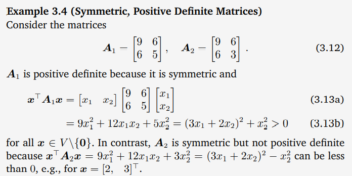
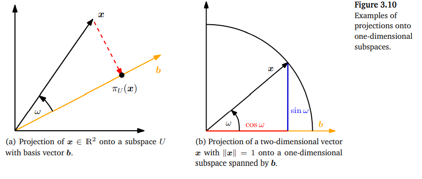
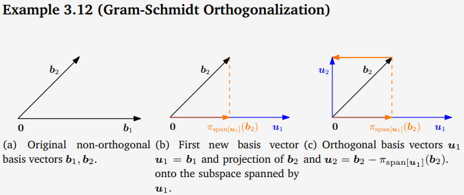
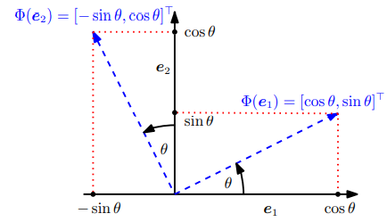

# Mathmatics for Machine Learning

## Chapter 03 Analytic Geometry

### 3.1 Norms
- **Definition 3.1 (Norm)** A ***norm*** on a vector space $V$ is a **function** $$||·|| : V → \mathbb{R} , \\\\ x \rightarrowtail ||x|| , $$ which assigns each vector $x$ its length $||x|| ∈ R$
  - such that for all $λ ∈ R$ and $x, y ∈ V$ the following hold:
    - Absolutely homogeneous: $||λx|| =  |λ|||x||$
    - Triangle inequality: $||x + y|| \le ||x|| + ||y||$
    - Positive definite: $||x|| > 0$ and $||x|| = 0 \iff x=0$
- Manhattan Norm $||x||:=\sum |x_i|$ --$l_1$ 
- Euclidean norm $$||x|| := \sqrt{\sum{x_i^2}} = \sqrt{x^Tx}$$
### 3.2 Inner Products
- Inner products allow for the introduction of intuitive geometrical concepts,
  - such as **the length of a vector** and **the angle or distance between two vectors**

#### 3.2.1 Dot Product
- ***The scalar product/dot product*** in $R^n$, which is given by $$x^Ty=\sum x_iy_i$$
  - We will refer to this particular inner product as the **dot product**

#### 3.2.2 General Inner Products
- ***bilinear mapping*** A bilinear mapping $Ω$ is a mapping with two arguments, and it is **linear in each argument**
  -  look at a vector space $V$ then it holds that 
     -  for all $x, y, z ∈ V, λ, ψ ∈ R$ that $$Ω(λx + ψy, z) = λΩ(x, z) + ψΩ(y, z)  \\\\ Ω(x, λy + ψz) = λΩ(x, y) + ψΩ(x, z)$$
- **Definition 3.2** Let $V$ be a vector space and $Ω : V × V → R$ be a bilinear mapping that takes two vectors and maps them onto a real number
  - $Ω$ is called ***symmetric*** if $Ω(x, y) = Ω(y, x)$ for all $x, y ∈ V$
    - order does not matter
  - $Ω$ is called ***positive definite*** if $$∀x ∈ V \backslash \{0\} : Ω(x, x) > 0 , Ω(0, 0) = 0 $$
- **Definition 3.3** Let $V$ be a vector space and $Ω : V × V → R$ be a bilinear
mapping that takes two vectors and maps them onto a real number
  - A **positive definite**, **symmetric** bilinear mapping $Ω : V ×V → R$ is called an ***inner product*** on V
    - write $<x, y>$ instead of $Ω(x, y)$
  - The pair $(V,<·, ·>)$ is called an ***inner product space*** or (real) ***vector space with inner product***. 

#### 3.2.3 Symmetric, Positive Definite Matrices
- Symmetric, positive definite matrices play an important role in machine learning, and they are defined via the inner product.
- The idea of symmetric positive semidefinite matrices is key in the definition of kernels 
- $n$-dimensional vector space $V$ with an inner product $<·, ·>: V × V → R$ and an ordered basis $B = (b_1, . . . , b_n)$ of $V$
  - vector $x =\sum ψ_ib_i ∈ V, ψ_i\in R$
  - vector $y= \sum λ_jb_j ∈ V,  λ_j ∈ R$
  - Due to the bilinearity of the inner product $$<x,y> = <\sum ψ_ib_i, \sum λ_jb_j> = \sum\sum ψ_i<b_i, b_j> λ_j = \hat{x}^TA\hat{y} ,$$ where $A_{ij} := <b_i, b_j>$ and $\hat{x}, \hat{y}$ are the coordinates of x and y with respect to the basis B.
    - This implies that the inner product $<·, ·>$ is uniquely determined through $A$
    - The symmetry of the inner product also means that A is symmetric
    - the positive definiteness of the inner product implies $$∀x ∈ V \backslash \{0\} : x^TAx > 0 $$
- **Definition 3.4 (Symmetric, Positive Definite Matrix)**
  - A symmetric matrix $A\in R^{n×n}$ that satisfies $∀x ∈ V \backslash \{0\} : x^TAx > 0 $ is called **symmetric, positive definite**, or **positive definite**
    - If only > holds, then A is called symmetric positive semidefinite. 
  - If $A ∈ R^{n×n}$ is symmetric, positive definite, then $$<x, y> = \hat{x}^TA\hat{y}$$ defines an inner product with respect to **an ordered basis B**
    - $\hat{x}$ and $\hat{y}$ are the coordinate representations of $x, y ∈ V$ with respect to B.
- **Theorem 3.5** For a **real-valued**, **finite-dimensional** vector space $V$ and an **ordered basis** $B$ of V , it holds that $<·, ·> : V × V → R$ is an **inner product** *if and only if* there exists a **symmetric, positive definite** matrix $A ∈ R^{n×n}$ with $$<x,y>=\hat{x}^TA\hat{y}$$
- properties for A
  - The **null space (kernel)** of $A$ consists **only of 0** because $x^TAx > 0$ for all $x \neq 0$. 
    - This implies that $Ax \neq 0$ if $x \neq 0$
  - The diagonal elements $a_{ii}$ of $A$ are positive because $a_{ii} = e_i^TAe_i>0$ 
    - where $e_i$ is the $i$th vector of the **standard basis** in $R^n$

### 3.3 Lengths and Distances
- any inner product induces a norm $$||x||:=\sqrt{{\lang x,x\rang}}$$
- **(Cauchy-Schwarz Inequality)** For an inner product vector space $(V,\lang·, ·\rang)$ the induced norm $||·||$ satisfies the Cauchy-Schwarz inequality $$|\lang x,y \rang|\le \lVert x \rVert \lVert y \rVert$$
- **Definition 3.6 (Distance and Metric)** Consider an inner product space $(V,\lang·, ·\rang)$ Then $$d(x, y) := \lVert x-y \rVert = \sqrt{\lang x − y,x-y \rang}$$ is called the ***distance*** between $x$ and $y$ for $x, y ∈ V$ 
  - If we use the **dot product** as the **inner product**, then the distance is called **Euclidean distance**
  - The mapping $$d:V \times V \rightarrow R \\\\ (x,y)\rightarrowtail d(x,y)$$ is called ***metric*** (这是一个运算)
    - $d$ is positive definite,
      - $d(x, y) > 0$ for all $x, y ∈ V$ and $d(x, y) =0 \iff x = y$ .
      - $d$ is symmetric, i.e., $d(x, y) = d(y, x)$
      - *Triangle inequality*: $d(x, z) \le d(x, y) + d(y, z)$ for all $x, y, z ∈ V$ .
- Very **similar** x and y will result in 
  - a **large** value for the **inner product** 
  - and a **small** value for the **metric**.

### 3.4 Angles and Orthogonality
- inner products also capture the geometry of a vector space by defining the angle $ω$ between two vectors
- Assume that $x \neq 0, y \neq 0$. Then $$-1\le \frac{\lang x,y \rang}{\lVert x \rVert \lVert y \rVert}\le 1$$
  - Therefore, there exists a **unique** $ω ∈ [0, π]$ with $$\cos ω = \frac{\lang x,y \rang}{\lVert x \rVert \lVert y \rVert}$$
    - The number $ω$ is the **angle** between the vectors $x$ and $y$
- **Definition 3.7 (Orthogonality)** Two vectors $x$ and $y$ are ***orthogonal*** if and only if $\lang x,y \rang = 0$
  - we write $x ⊥ y$
  - If additionally $||x|| = 1 = ||y||$ then x and y are ***orthonormal***
- 0-vector is orthogonal to every vector in the vector space
- **Definition 3.8 (Orthogonal Matrix)** A square matrix $A ∈ R^{n×n}$ is an ***orthogonal matrix*** if and only if its **columns are orthonormal** so that $$AA^T=I=A^TA$$ 
  - implies $A^{-1}=A^T$
- Transformations by orthogonal matrices are special
  - the length of a vector x is not changed 
  - the angle between any two vectors x, y, as measured by their inner product, is also unchanged

### 3.5 Orthonormal Basis
- ***Definition 3.9 (Orthonormal Basis)*** Consider an $n$-dimensional vector space $V$ and a basis $\{b1, . . . , bn\}$ of $V$ . If $$<b_i,b_j>=0 \leftarrow i\neq j \\\\ <b_i,b_i>=1$$ for all $i, j = 1, . . . , n$ then the basis is called an ***orthonormal basis (ONB)***.
  - If only $<b_i,b_j>=0$ is satisfied, then the basis is called an ***orthogonal basis***
- 求标准正交方法 Gram-Schmidt process
  - Assume we are given a set $\{˜b1, . . . ,˜bn\}$ of non-orthogonal and unnormalized basis vectors
  - concatenate them into a matrix $B˜ = [˜b1, . . . ,˜bn]$
  -   apply Gaussian elimination to $[B˜B˜^T|B˜]$ to obtain an orthonormal basis

### 3.6 Orthogonal Complement
- onsider a $D$-dimensional vector space $V$ and an $M$-dimensional sub-space $U ⊆ V$ . Then its ***orthogonal complement*** $U^⊥$ is a $(D−M)$-dimensional **orthogonal complement subspace** of $V$ and contains all vectors in $V$ that are **orthogonal to every vector** in $U$
  - $U ∩ U^⊥ = \{0\}$
  - so that any vector $x ∈ V$ can be uniquely decomposed into $$x=\sum^{M}_{m}λ_mb_m + \sum^{D-M}_{j} ψ_jb^⊥_j, λ,ψ \in R$$
    - where $(b1, . . . , bM)$ is a basis of $U$ and $(b^⊥1, . . . , b^⊥_{D−M})$ is a basis of $U^⊥$
- Generally, orthogonal complements can be used to describe **hyperplanes**
in n-dimensional vector and affine spaces

### 3.7 Inner Product of Functions
- An inner product of two **functions** $u : R → R$ and $v : R → R$ can be defined as the definite integral $$<u,v>=\int^{b}_{a}u(x)v(x)dx$$ for lower and upper limits a, b < ∞
  -  If evaluates to 0, the functions $u$ and $v$ are orthogonal. 
     - sin(x)cos(x) in [-Π,Π]
- It also holds that the collection of functions $$\{1, \cos(x), \cos(2x), \cos(3x), . . . \} $$ is **orthogonal** if we integrate from −π to π
  - The collection of functions spans a large subspace of the functions that are **even** and **periodic** on $[−π, π)$
    - projecting functions onto this subspace is the fundamental idea behind **Fourier series**

### 3.8 Orthogonal Projections
- ***Definition 3.10 (Projection)*** Let $V$ be a vector space and $U ⊆ V$ a subspace of $V$ . A linear mapping $π : V → U$ is called a projection if $π^2 = π ◦ π = π$.
  - the ***projection matrices*** $P_π$, which exhibit the property that $P^2_π = P_π$.
-  we assume the dot product $\lang x, y\rang = x^Ty$ as the inner product.

#### 3.8.1 Projection onto One-Dimensional Subspaces (Lines)
- Assume we are given a **line (one-dimensional subspace)** through the origin with basis vector $b ∈ R^n$
  - The line is a one-dimensional subspace $U ⊆ R^n$ spanned by $b$
- When we project $x ∈ R^n$ onto $U$, we seek the vector $π_U (x) ∈ U$ that is **closest** to $x$ 
  - “closest” implies that the distance $\lVert x−πU (x)\rVert$ is **minimal**.
    - It follows that the segment $(π_U (x)−x) \bot b$ 
  - The projection $π_U (x)$ of $x$ onto $U$ must be an element of $U$
    - Thus, $π_U (x) = λb$ for some $λ ∈ R$
- In the following **three** steps, we determine the coordinate $λ$, the projection $π_U (x) ∈ U$, and the projection matrix $P_π$ that maps any $x ∈ Rn$ onto $U$:
  1. Finding the coordinate $λ$. 
     1. $$<x − π_U (x), b> = 0 \iff <x − λb, b> =0$$
     2. exploit the bilinearity of the inner product and arrive at $$<x,b>-\lambda<b,b> = 0 \iff \lambda=\frac{<x,b>}{<b,b>}=\frac{<b,x>}{\lVert b \rVert^2}$$
     3. exploited  the fact that inner products are symmetric
     4. if dot product $$\lambda =\frac{b^Tx}{b^Tb}=\frac{b^Tx}{\lVert b \rVert^2 }$$
  2. Finding the projection point $π_U (x) ∈ U$ $$π_U (x) = λb=\frac{b^Tx}{\lVert b \rVert^2 }b \\\\ \lVert π_U (x)\rVert = \lVert\lambda b\rVert = |\lambda|\lVert b\rVert$$
     1. our projection is of length $|λ|$ times the length of $b$
     2. Intuitionally, $λ$ is the coordinate of $π_U (x)$ with respect to the basis vector $b$
     3. If we use the dot product as an inner product, we get $$\lVert π_U (x)\rVert = \frac{b^Tx}{\lVert b \rVert^2 } \lVert b\rVert = |\cos \omega| \lVert x\rVert \lVert b\rVert \frac{\lVert b\rVert}{\lVert b \rVert^2 }=|\cos \omega| \lVert x\rVert$$
        1. $ω$ is the angle between $x$ and $b$
  3. Finding the projection matrix $P_π$ $$π_U (x) = P_πx \rightarrow P_πx = \lambda bx = \frac{ bb^T }{\lVert b \rVert^2 }x  \\\\ P_πx= \frac{ bb^T}{\lVert b \rVert^2 }$$
     1. $bb^T$  is a symmetric matrix (rk=1)
     2. $\lVert b\rVert^2 = \lang b,b \rang$ is a scalar.
- The projection $π_U (x) ∈ R^n$ is still an **n-dimensional vector** and not a scalar
  -  but we no longer require n coordinates to represent the projection
     -  just $\lambda$ with basis $b$

#### 3.8.2 Projection onto General Subspaces
- we look at orthogonal projections of vectors $x ∈ R^n$ onto lower-dimensional subspaces $U ⊆ R^n$ with $dim(U) = m > 1$. Assume that $(b1, . . . , bm)$ is an ordered basis of $U$, such that $π_U (x) = \sum^{m}_{i=1}λ_ib_i$
- three-step procedure
  1. Find the coordinates $λ1, . . . , λm$ of the projection (with respect to the basis of $U$), such that the linear combination $$π_U (x) = \sum^{m}_{i=1}λ_ib_i = Bλ, \\\\ B= [b1, . . . , bm] ∈ R^{n×m}, λ = [λ1, . . . , λm]^T ∈ R^m $$
     1. As in the 1D case, “closest” means “minimum distance”, which implies that the vector connecting $π_U (x) ∈ U$ and $x ∈ R^n$ must be orthogonal to all basis vectors of $U$. Therefore,$$\lang b_1,x − π_U (x)\rang = b_1^T(x − π_U (x))=0 \\\\ \vdots \\\\ \lang b_m,x − π_U (x)\rang = b_m^T(x − π_U (x))=0$$ with $π_U (x) = Bλ$, can be written as $$\begin{bmatrix}b_1^T \\ \vdots \\ b_m^T \end{bmatrix}\begin{bmatrix}x − Bλ\end{bmatrix} =0\iff B^T(x-B\lambda)=0\iff B^TBλ = B^Tx$$
        1. The last expression is called normal equation
     2. Since b1, . . . , bm are a basis of U and, therefore, linearly independent, $B^TB ∈ R^{m×m}$ is **regular** and can be **invert**. Thus $$\lambda = (B^TB)^{-1}B^Tx$$
        1. $(B^TB)^{-1}B^T$ is also called the ***pseudo-inverse of $B$***.
           1. can be computed for non-square matrices B
           2. only requires that $B^TB$is **positive definite**, which is the case if $B$ is **full rank**
  2. Find the projection $π_U (x) ∈ U$. We already established that $π_U (x) =Bλ$. Therefore, $$π_U (x) =B(B^TB)^{-1}B^Tx$$
  3. Find the projection matrix $P_π$. $$P_πx = π_U(x) \rightarrow P_π = B(B^TB)^{-1}B^T $$
- ***projection error*** is the norm of the difference vector between the original vector and its projection onto $U$
- Projections allow us to look at situations where we have a linear system $Ax = b$ **without a solution** 
  - Recall that this means that $b$ does not lie in **the span of A**
  - we can find an ***approximate solution***. The idea is to find the vector in the subspace spanned by the columns of $A$ that is **closest to $b$**,
    - This problem arises often in practice, and the solution is called the **least-squares solution** 
- If this basis $b$ is an **ONB**, , the projection equation (3.58) simplifies greatly to $$π_U (x) = BB^T \\\\ \lambda = B^Tx$$ 
  
#### 3.8.3 Gram-Schmidt Orthogonalization
- The ***Gram-Schmidt orthogonalization method*** **iteratively** constructs an orthogonal basis $(u1, . . . ,un)$ from any basis $(b1, . . . , bn)$ of $V$ as follows $$u_1 = b_1 \\ u_k = b_k-π_{span[u_1,...,u_{k−1}]}(b_k),$$. 
  -  the $k$th basis vector $b_k$ is **projected** onto the subspace spanned by the first $k − 1$ constructed orthogonal vectors $u_1, . . . ,u_{k−1}$
  -  Repeating this procedure for all $n$ basis 
  -  If we **normalize** the $u_k$, we obtain an **ONB** where $\lVert u\rVert = 1$ for $k = 1, . . . , n$

#### 3.8.4 Projection onto Affine Subspaces
- We are given an affine space $L =x_0 + U$, where $b_1, b_2$ are basis vectors of $U$. To determine the orthogonal projection $π_L(x)$ of $x$ onto $L$ 
  - we subtract the support point $x_0$ from $x$ and from $L$, so that $L − x_0 = U$ is exactly the vector subspace $U$.
    - $π_L(x) = x_0 + π_U (x − x0),$
    - $d(x, L) = \lVert x − π_L(x) \rVert = \lVert x − (x_0 + π_U (x − x_0))\rVert \\\\ = d(x − x_0, π_U (x − x_0)) = d(x − x_0, U)$ 

### 3.9 Rotations
- A rotation is a linear mapping (more specifically, an **automorphism** of  a Euclidean vector space) that rotates a plane by an angle $θ$ about the origin 
- Consider the standard basis  
  -  

#### 3.9.3 Rotations in n Dimensions
- ***Definition 3.11 (Givens Rotation).*** Let $V$ be an n-dimensional Euclidean vector space and $Φ : V → V$ an **automorphism** with transformation matrix $$R_{ij}(\theta)=\begin{bmatrix} &I_{i-1} &0 &\dots &\dots &0 \\ &0 &\cos \theta &0 &-\sin \theta &0 \\&0 &0 &I_{j-i-1} &0 &0 \\ &0 &\sin \theta &0 &\cos \theta &0 \\ &0 &\dots &\dots &0 &I_{n-j}\end{bmatrix} ∈ R^{n×n}$$ for $1 \le i < j \le n$ and $θ ∈ R$. Then $R_{ij} (θ)$ is called a ***Givens rotation***.
  - Essentially, $R_ij (θ)$ is the identity matrix $I_n$ with $$r_{ii} = \cos θ , r_{ij} = − \sin θ , r_{ji} = \sin θ , r_{jj} = \cos θ$$
  - In two dimensions (i.e., n = 2), we obtain  a special case.

#### 3.9.4 Properties of Rotations
- Rotations preserve **distances**, i.e., $\lVert x-y \rVert=\lVert R_θ(x)−R_θ(y)\rVert$
- Rotations preserve **angles** -- the angle between $R_θx$ and $R_θy$ equals the angle between $x$ and $y$.
- Rotations in **three (or more)** dimensions are generally **not commutative**
  - They form an Abelian group (with multiplication) only if they **rotate about the same point** 