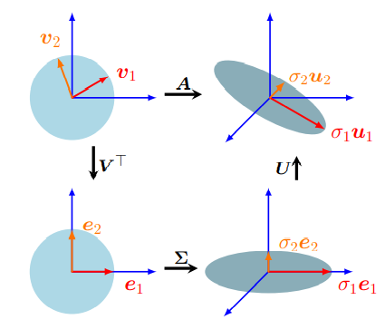

# Mathmatics for Machine Learning

## Chapter 04 Matrix Decompositions
- In this chapter, we present three aspects of matrices: 
  - how to **summarize** matrices,
  - how matrices can be **decomposed**, 
  - and how these decompositions can be used for matrix **approximations**.

### 4.1 Determinant and Trace
-  A ***determinant*** is a mathematical object in the analysis and solution of systems of linear equations
   -  Determinants are only defined for square matrices $A ∈ R^{n×n}$
- The **determinant** of a **square matrix** $A ∈ R^{n×n}$ is a function that maps $A$ onto a real number
- ***Theorem 4.1***. For any square matrix $A ∈ R^{n×n}$ it holds that $A$ is **invertible** if and only if $\det(A) \neq 0$.
-  Sarrus’ rule
-  We call a square matrix $T$ an ***upper-triangular matrix*** if $T_{ij} = 0$ for $i > j$
   -  i.e., the matrix is zero below its diagonal.
   -  反之则 ***lower-triangular matrix***
   -  $\det(T)=\prod^{n}_{i=1}T_{ij}$
- Determinants as Measures of Volume
  - det(A) is the **signed volume** of an $n$-dimensional parallelepiped formed by columns of the matrix A.
- ***Theorem 4.2 (Laplace Expansion).*** Consider a matrix $A ∈ R^{n×n}$ . Then, for all $j = 1, . . . , n$:
  - ***Expansion*** along **column** $j$ $$\det(A)=\sum^{n}_{k=1}{(−1)^{k+j}a_{kj}\det(A_{k,j}).}$$
  - ***Expansion*** along **row** $j$ $$\det(A)=\sum^{n}_{k=1}{(−1)^{k+j}a_{jk}\det(A_{j,k}).}$$
  - $\det(A_{j,k})$ called a ***minor***
  - $(−1)^{k+j}\det(A_{j,k})$ called a ***cofactor*** 
- By **recursively** applying the ***Laplace expansion*** (Theorem 4.2), we can therefore compute determinants of $n × n$ matrices by ultimately computing determinants of $2 × 2$ matrices
- For $A ∈ R^{n×n} the determinant exhibits the following properties
  - $\det(AB) = \det(A)\det(B)$ 
    - The determinant of a matrix product is the product of the corresponding determinants.
  - $det(A) = det(A^T)$ Determinants are invariant to transposition
  - If $A$ is regular (invertible), then $\det(A^{−1}) = \frac{1}{\det(A)}$
  - **Similar matrices** (Definition 2.22) possess the **same determinant** 
    - for a linear mapping $Φ : V → V$ all transformation matrices $A_Φ$ of $Φ$ have the same determinant
      - the determinant is **invariant** to **the choice of basis** of a linear mapping
  - **Adding** a multiple of a column/row to another one **does not change** $\det(A)$.
  - **Multiplication** of a column/row with $λ ∈$ R scales $\det(A)$ by $λ$. In particular, $\det(λA) = λ^n \det(A)$
  - **Swapping** two rows/columns changes the **sign** of $\det(A)$
- Because of the last three properties, we can use **Gaussian elimination** (see Section 2.1) to compute $\det(A)$ by bringing A into row-echelon form
  - stop when we have $A$ in a **triangular** form
- ***Theorem 4.3.*** A square matrix $A ∈ R^{n×n}$ has $\det(A) \neq 0$ if and only if $rk(A) = n$. 
  - In other words, $A$ is **invertible** if and only if it is **full rank**.
- ***Definition 4.4.*** The trace of a square matrix $A ∈ R^{n×n}$ is defined as $$tr(A)=\sum^{n}_{i=1}a_{ii}$$
  -  the trace is the sum of the diagonal elements of $A$.
- The trace satisfies the following properties:
  - $tr(A + B) = tr(A) + tr(B)$ for $A, B ∈ R^{n×n}$
  - $tr(αA) = αtr(A)$, $α ∈ R$ for $A ∈ R^{n×n}$
  - $tr(I_n) = n$
  - $tr(AB) = tr(BA)$ for $A ∈ R^{n×k}, $B ∈ R^{k×n}$
  - $tr(AKL) = tr(KLA)$
    - $A ∈ R^{a×k}$
    - $K ∈ R^{k×l}$
    - $L ∈ R^{l×a}$
    - $tr(xy^T) = tr(y^Tx) = y^Tx ∈ R$ .As a special case, for two vectors $x, y ∈ R^{n}$
    - $tr(B) = tr(S^{−1}AS)= tr(ASS^{−1}) = tr(A)$  
      - the corresponding transformation matrix $B$ of $Φ: V → V$ can be obtained by a basis change of the form $S^{−1}AS$ for suitable $S$
      - the **trace** of a linear mapping $Φ$ is **independent** of the **basis**.
- ***Definition 4.5 (Characteristic Polynomial).*** For λ ∈ R and a square matrix $A ∈ R^{n×n}$ $$p_A(λ) := \det(A − λI) \\\\ = c_0 + c_1λ + c_2λ + · · · + c_{n−1}λ_{n−1} + (−1)^{n}λ_n$$
  - $c_0, . . . , c_{n−1} ∈ R$, is the ***characteristic polynomial*** of $A$
  -  In particular, $$c_0=\det(A)\\\\c_{n-1}=(-1)^{n-1}tr(A)$$

### 4.2 Eigenvalues and Eigenvectors
- ***Definition 4.6.*** Let $A ∈ R^{n×n}$ be a square matrix. Then ^λ ∈ R^ is an ***eigenvalue*** of $A$ and $x ∈ R^{n}\backslash\{0\}$ is the corresponding ***eigenvector*** of $A$ if $$Ax = λx$$
  - this is called ***eigenvalue equation***.
- In the linear algebra **literature** and **software**, it is often a **convention** that eigenvalues are sorted in **descending order**
  -  the **largest** eigenvalue and associated eigenvector are called the **first** eigenvalue and its associated eigenvector
  -  可以有但没有必要
- The following statements are equivalent:
  - $λ$ is an **eigenvalue** of $A ∈ R^{n×n}
  - There exists an $x ∈ R^{n}\backslash\{0\}$ with $Ax = λx$, or equivalently, $(A −λI_n)x = 0$ can be solved non-trivially, i.e., $x \neq 0$.
  - $rk(A − λI_n) < n$
  - $\det(A − λI_n) = 0$
- ***Definition 4.7 (Collinearity and Codirection).*** Two vectors that point in the **same direction** are called ***codirected***. Two vectors are ***collinear*** if they point in **the same or the opposite direction**
- *Non-uniqueness of eigenvectors* If $x$ is an **eigenvector** of $A$ associated with **eigenvalue** $λ$, then for any $c ∈ R\backslash\{0\}$ it holds that $cx$ is an **eigenvector** of $A$ with the same eigenvalue since $$A(cx) = cAx = cλx = λ(cx)$$
  - all vectors that are **collinear** to $x$ are also **eigenvectors** of $A$.
- ***Theorem 4.8.*** $λ ∈ R$ is an **eigenvalue** of $A ∈ Rn×n$ if and only if $λ$ is a **root** of the **characteristic polynomial** $p_A(λ)$ of $A$
- ***Definition 4.9.*** Let a square matrix $A$ have an eigenvalue $λi$. The ***algebraic multiplicity*** of $λ_i$ is the **number of times** the root appears in the **characteristic polynomial**.
- ***Definition 4.10 (Eigenspace and Eigenspectrum)*** For $A ∈ R^{n×n}$, \
  - the set of **all eigenvectors** of $A$ associated with **one eigenvalue** $λ$ spans a subspace of $R^n$ , which is called the ***eigenspace*** of $A$ with respect to $λ$ and is denoted by $E_λ$. 
    - $E_λ$ is the solution space of $(A−λI)x = 0$.
  - The set of **all eigenvalues** of $A$ is called the ***eigenspectrum***, or just ***spectrum***, of $A$.
- Useful properties regarding eigenvalues and eigenvectors:
  - A **matrix** $A$ and its **transpose** $A^T$ possess the same **eigenvalues**, but **not necessarily** the same **eigenvectors**.
  - The eigenspace $E_λ$ is the null space of $A − λI$ 
  - **Similar matrices** possess the **same eigenvalues**.
  - **Symmetric, positive definite matrices** always have **positive, real eigenvalues**
- ***Definition 4.11.*** Let $λ_i$ be an **eigenvalue** of a square matrix $A$. Then the ***geometric multiplicity*** of $λ_i$  is the number of **linearly independent eigenvectors** associated with $λ_i$. 
  - In other words, it is the **dimensionality** of the **eigenspace** spanned by the eigenvectors associated with $λ_i$.

- Graphical Intuition in Two Dimensions
  - $A_1 = \begin{bmatrix}0.5&0\\0&2\end{bmatrix}$ The mapping is area
  preserving $\det(A)=1$
  - $A_2 = \begin{bmatrix}1&0.5\\0&1\end{bmatrix}$ a shearing mapping
  - $A_3 = \begin{bmatrix}\cos(\frac{\pi}{6})&-\sin(\frac{\pi}{6})\\\sin(\frac{\pi}{6})&\cos(\frac{\pi}{6})\end{bmatrix}$ The matrix A3 rotates the points by $\frac{π}{6}rad = 30◦$ counter-clockwise and has only complex eigenvalues, reflecting that the mapping is a rotation (hence, no eigenvectors
  are drawn).
  - $A_4 = \begin{bmatrix}1&-1\\-1&1\end{bmatrix}$ **collapses** a two-dimensional domain onto one dimension.
  - $A_2 = \begin{bmatrix}1&0.5\\0.5&1\end{bmatrix}$ is a **shear-and-stretch** mapping
  

- ***Theorem 4.12.*** The eigenvectors $x_1, . . . , x_n$ of a matrix $A ∈ R^{n×n}$ with $n$ distinct eigenvalues $λ_1, . . . , λ_n$ are linearly independent.
- ***Definition 4.13.*** A square matrix $A ∈ R^{n×n}$ is defective if it possesses fewer than n linearly independent eigenvectors
- ***Theorem 4.14.*** Given a matrix $A ∈ R^{m×n}$, we can always obtain a symmetric, positive semidefinite matrix $S ∈ R^{n×n}$ by defining $$S:=A^TA$$
  - If $rk(A) = n$, then $S := A^TA$ is symmetric, positive definite
- ***Theorem 4.15 (Spectral Theorem).*** If $A ∈ R^{n×n}$ is **symmetric**, there exists an **orthonormal basis** of the corresponding vector space $V$ consisting of **eigenvectors** of $A$, and each eigenvalue is **real**.
  - A direct implication is that the **eigendecomposition** of a **symmetric** matrix $A$ **exists** (with real eigenvalues),
  - we can find an **ONB** of eigenvectors so that $A = P^TDP$, where $D$ is **diagonal** and the columns of $P$ contain the **eigenvectors**.
- ***Theorem 4.16.*** The determinant of a matrix $A ∈ R^{n×n}$ is the product of its eigenvalues, i.e., $$\det(A)=\prod^{n}_{i=1}\lambda_i$$
  - where $λ_i ∈ C$ are (possibly repeated) **eigenvalues** of $A$.

### 4.3 Cholesky Decomposition
- The Cholesky decomposition/Cholesky factorization provides a **square-root equivalent operation** on **symmetric, positive definite matrices** that is useful in practice.
- ***Theorem 4.18 (Cholesky Decomposition)***. A **symmetric, positive definite** matrix $A$ can be **factorized** into a product $A = LL^T$, where $L$ is a **lower-triangular** matrix with **positive** diagonal elements: $$\begin{bmatrix}a_{11}&\dots&a_{1n}\\\vdots&\ddots&\vdots\\a_{n1}&\dots&a_{nn}\end{bmatrix}=\begin{bmatrix}l_{11}&\dots&0\\\vdots&\ddots&\vdots\\l_{n1}&\dots&l_{nn}\end{bmatrix}\begin{bmatrix}l_{11}&\dots&l_{n1}\\\vdots&\ddots&\vdots\\0&\dots&l_{nn}\end{bmatrix}$$ 
  - $L$ is called the ***Cholesky factor*** of $A$, and $L$ is **unique**.
- Given the Cholesky decomposition $A = LL^T$, we get $\det(A) = \det(L)det(L^T) = det(L)^2$
  - the determinant is simply the product of its **diagonal entries** so that $\det(A) = \prod l_{ii}^2$
  - many numerical software packages use the Cholesky decomposition to **make computations more efficient**

### 4.4 Eigendecomposition and Diagonalization
- ***Definition 4.19 (Diagonalizable).*** A matrix $A ∈ R^{n×n}$ is **diagonalizable** if it is **similar** to **a diagonal matrix**, 
  - i.e., if there exists an **invertible matrix** $P ∈ R^{n×n} such that $D = P^{−1}AP$ .
- We define $P := [p_1, . . . , p_n]$ and let $D ∈ R^{n×n}$ be a diagonal matrix with diagonal entries $λ_1, . . . , λ_n$. Then we can show that $$AP=PD$$ **if and only if** $λ_1, . . . , λ_n$ are the eigenvalues of $A$ and $p_1, . . . , p_n$ are corresponding eigenvectors of $A$. 
  - We can see that this statement holds because $$AP = A[p_1, . . . , p_n] = [Ap_1, . . . , Ap_n], \\ PD=[p_1, . . . , p_n]diag([\lambda_1,\dots,\lambda_n]) = [λ_1p_1, . . . , λ_np_n] $$
    - Thus, (4.50) implies that $$Ap_1=\lambda_1p_1 \\ \vdots \\ Ap_n=\lambda_np_n$$
    - Therefore, the columns of $P$ must be **eigenvectors** of A.
- ***Theorem 4.20 (Eigendecomposition).*** A square matrix $A ∈ R^{n×n}$ can be factored into $$A = P DP^{−1}$$ where $P ∈ R^{n×n}$ and $D$ is a diagonal matrix whose **diagonal entries** are the **eigenvalues** of $A$, if and only if the **eigenvectors** of A form a **basis** of $R^n$
  - only **non-defective** matrices can be diagonalized and that the columns of P are the n eigenvectors of A.
- ***Theorem 4.21.*** A **symmetric** matrix $S ∈ R^{n×n}$ can **always** be diagonalized.
- The **Jordan normal form** of a matrix offers a decomposition that works for **defective** matrices 

- Geometric Intuition for the Eigendecomposition
  - Diagonal matrices D can efficiently be raised to a **power**
    - $A^k = (P DP^{−1})^k = P D^kP^{−1}$
    - Computing $D^k$ is efficient because we apply this operation individually to any diagonal element
  - Assume that the eigendecomposition $A = P DP^{−1}$ exists.
    - $\det(A) = \det(P DP^{−1}) = \det(P )\det(D)\det(P^{−1})=\det(D)=\prod d_{ii}$
    - allows for an **efficient computation** of the determinant of A.

### 4.5 Singular Value Decomposition
- “fundamental theorem of linear algebra”
- ***Theorem 4.22 (SVD Theorem).*** Let $A^{m×n}$ be a rectangular matrix of rank $r ∈ [0, \min(m, n)]$. The ***SVD*** of $A$ is a decomposition of the form 
  - with an **orthogonal matrix** $U ∈ R^{m×m}$ with column vectors $u_i, i = 1, . . . , m$
  - an **orthogonal matrix** $V ∈ R^{n×n}$ with column vectors $v_j , j = 1, . . . , n$
  - $Σ$ is an $m × n$ matrix with $Σ_{ii} = σi > 0$ and $Σ_{ij} = 0, i \neq j$.
    - The singular value matrix $Σ$ is **unique**, but it requires some attention
    - **rectangular** matrix $Σ$ is of the same size as A
      - Σ has a **diagonal submatrix** that contains the **singular values** and needs additional **zero padding**   
        -  
        - 
  - The diagonal entries $σ_i, i = 1, . . . , r$, of $Σ$ are called the ***singular values***, 
    - By convention, the singular values are **ordered**, i.e., $σ_1 \ge σ_2 \ge σ_r \ge 0$.
  - $u_i$ are called the ***left-singular vectors***, and $v_j$ are called the ***right-singular vectors***

#### 4.5.1 Geometric Intuitions for the SVD
- The SVD of a matrix can be interpreted as a decomposition of a corresponding linear mapping $Φ : R^n → R^m$ into **three operations**;   
  - 
  - Broadly speaking, the ***SVD*** performs a **basis change** via $V^T$
  - followed by a **scaling** and **augmentation** (or reduction) in dimensionality via the **singular value matrix** $Σ$.
  -  Finally, it performs a **second basis change** via $U$
- Assume we are given a transformation matrix of a linear mapping $Φ : R^n → R^m$ with respect to the standard bases $B$ and $C$ of $R^n$ and $R^m$. Moreover, assume a second basis $B˜$ of $R^n$ and $C˜$ of $R^m$.
  -  The matrix $V$ performs a basis change in the domain $R^n$ from $B˜$
     -  represented by $v_1$ and $v_2$
     -  $V^T = V−1$ performs a basis change from $B$ to $B˜$.
     -  The red and orange vectors are now aligned with canonical basis
  - Having changed the coordinate system to $B˜$, $Σ$ **scales** the new coordinates by the singular values $σ_i$ (and **adds or deletes dimensions**),
    - $Σ$ is the transformation matrix of $Φ$ with respect to $B˜$ and $C˜$,
  - $U$ performs a basis change in the codomain $R^m$ from $C˜$ into the canonical basis of $R^m$
  - The SVD expresses a change of basis in both the **domain** and **codomain**.
    -  in contrast with the **eigendecomposition** that operates within the **same** vector space

#### 4.5.2 Construction of the SVD
- Compare the eigendecomposition of an **SPD** matrix $$S=S^T=PDP^T$$
  - with the corresponding SVD $$S= UΣV^T$$
  - If we set $$U = P = V , D = Σ$$
  - the **SVD** of **SPD** matrices is their eigendecomposition
- Computing the **SVD** of $A ∈ R^{m×n} is equivalent to finding two sets of orthonormal bases 
  - $U = (u_1, . . . ,u_m)$of the **codomain** $R^m$
  - $V = (v_1, . . . , v_n)$ of the **domain** $R^n$
- Our plan is to start with 
  1. constructing the **orthonormal set** of **right-singular vectors** $v_1, . . . , v_n ∈ R^n$
     - we can always construct a symmetric, positive semidefinite matrix $A^TA ∈ R^{n×n}$
      - Thus, we can always **diagonalize** $A^TA$ and obtain $$A^TA=PDP^T=P\begin{bmatrix}\lambda_1 &0 &0 \\ 0 &\ddots &0 \\ 0 &0 &\lambda_n\end{bmatrix}P^T$$
        - $P$ is an orthogonal matrix, which is composed of the **orthonormal** eigenbasis.
        - The $λ_i \ge 0$ are the eigenvalues of $A^TA$.
      - **Assume** the SVD of A exists. This yields $$A^TA=(UΣV^T)^T(UΣV^T)=VΣ^TU^TUΣV^T$$
        - $U$,$V$ are orthogonal matrices $U^TU = I$
        - Thus $A^TA=V\begin{bmatrix}\sigma_1^2 &0 &0 \\ 0 &\ddots &0 \\ 0 &0 &\sigma_n^2\end{bmatrix}V^T$
      - Compare we get $$V^T=P^T \\ \sigma_i^2 = \lambda_i$$
      - Therefore, the **eigenvectors** of $A^TA$ that compose $P$ are the **right-singular vectors** $V$ of $A$
      - The eigenvalues of $A^TA$ are the squared singular values of $Σ$
  2. then construct the **orthonormal set** of **left-singular vectors** $u_1, . . . ,u_m ∈ R_m$
  - start by computing the SVD of the symmetric matrix $AA^T ∈ R^{m×m}$.The SVD of A yields $$AA^T=(UΣV^T)(UΣV^T)^T=UΣV^TVΣ^TU^T \\ = U\begin{bmatrix}\sigma_1^2 &0 &0 \\ 0 &\ddots &0 \\ 0 &0 &\sigma_m^2\end{bmatrix}U^T$$
   - The spectral theorem tells us that $AA^T = SDS^T$ can be **diagonalized**
   - we can find an ONB of eigenvectors of $AA^T$, which are collected in $S$.
   - The orthonormal eigenvectors of $AA^T$ are the **left-singular** vectors $U$, and form an **orthonormal basis** in the **codomain** of the SVD
   - Since $AA^T$ and $A^TA$ have the same nonzero eigenvalues, the nonzero entries of the Σ matrices in the SVD for both cases have to be the same
   - To complete the SVD construction, we need left-singular vectors that are **orthonormal**: We normalize the images of the right-singular vectors $Av_i$ and obtain $$u_i=\frac{Av_i}{\lVert Av_i \rVert} = \frac{1}{\sqrt{\lambda_i}}Av_i=\frac{1}{\sigma_i}Av_i$$
     - rearrange (4.78) to obtain the ***singular value equation*** $$Av_i=\sigma_iu_i, i=1,\dots,r$$
  3. Thereafter, **link** the two and require that the **orthogonality** of the $v_i$ is preserved under the transformation of $A$
     - because we know that the **images** $Av_i$ form a set of **orthogonal vectors**
     - Concatenating the $v_i$ as the columns of $V$ and the $u_i$ as the columns of $U$ yields $$AV=UΣ$$
     - Hence, right-multiplying with $V^T$ yields $A = UΣV^T$, which is the SVD of $A$.
  4.  then **normalize** these **images** by scalar factors, which will turn out to be the singular values.

#### 4.5.3 Eigenvalue Decomposition vs. Singular Value Decomposition
- Let us consider the eigendecomposition $A = PDP^{−1}$ and the SVD $A =UΣV^T$ 
  - The SVD always exists for any matrix $R^{m×n}$ The eigendecomposition isonly defined for square matrices $R^{n×n}$ and only exists if we can find a basis of eigenvectors of $R^n$
  - The vectors in the eigendecomposition matrix P are not necessarily orthogonal
    - On the other hand, the vectors in the matrices $U$ and $V$ in the SVD are orthonormal, so they do represent **rotations**.
  - Both the eigendecomposition and the SVD are compositions of **three linear mappings**:
    - Change of basis in the domain
    - Independent scaling of each new basis vector and mapping from domain to codomain
    - Change of basis in the codomain
  - The SVD and the eigendecomposition are closely related through their projections
    - The left-singular vectors of $A$ are **eigenvectors** of $AA^T$
    - The right-singular vectors of $A$ are **eigenvectors** of $A^TA$
    - The nonzero singular values of A are the **square roots** of the **nonzero eigenvalues** of $AA^T$ and $A^TA$
  - For symmetric matrices $A ∈ R^{n×n}$, the eigenvalue decomposition and the SVD are one and the same
- It is worth, to briefly discuss SVD **terminology** and **conventions**, as there are **different versions** used in the literature.
  - Our definition for the SVD is sometimes called the ***full SVD***.
    -  having two square left- and right-singular vector matrices, but a non-square singular value matrix
 - Some authors define the SVD a bit differently and focus on **square singular matrices**. Then, for $A ∈ R^{m×n}$ and $m \ge n$,  
   -  
   -  Sometimes this formulation is called the ***reduced SVD***
      -  The convenience of this alternative formulation is that $Σ$ is diagonal, as in the eigenvalue decomposition
   - matrix approximation techniques using the SVD, which is also called the ***truncated SVD***
   - A restriction that the SVD for A only applies to $m × n$ matrices with $m > n$ is practically unnecessary 

### 4.6 Matrix Approximation
- We construct a **rank-1** matrix $A_i ∈ R^{m×n}$ as $$A_i=u_iv_i^T$$
  -  Figure 4.11 shows an image of Stonehenge, which can be represented by a matrix $A ∈ R^{1432×1910}$, 
     -  
- A matrix $A ∈ R^{m×n}$ of rank $r$ can be written as a sum of rank-1 matrices $A_i$ so that $$A=\sum^{r}_{i=1}{σ_iu_iv_i^T}=\sum^{r}_{i=1}σ_iA_i$$
  - where the outer-product matrices $A_i$ are weighted by the ith singular value $σ_i$
- If the sum does not run over all matrices $A_i, i = 1, . . . , r$, but only up to an intermediate value $k < r$, we obtain a ***rank-k approximation*** $$\hat{A}=\sum^{k}_{i=1}{σ_iu_iv_i^T}=\sum^{k}_{i=1}σ_iA_i$$ of $A$ with $rk(\hat{A}(k)) = k$ 
- To measure the **difference (error)** between $A$ and its **rank-k approximation** $\hat{A} (k)$, we need the notion of a **norm**.
- ***Definition 4.23 (Spectral Norm of a Matrix)*** For $x ∈ R^{n}\backslash\{0\}$, the spectral norm of a matrix $A ∈ R^{m×n}$ is defined as $$\lVert A\rVert_2=\max_{x}\frac{\lVert Ax\rVert_2}{\lVert x\rVert_2}$$
- ***Theorem 4.24.*** The spectral norm of $A$ is its **largest singular value** $σ_1$.
- ***Theorem 4.25 (Eckart-Young Theorem (Eckart and Young, 1936)).*** Consider a matrix $A ∈ R^{m×n}$ of rank $r$ and let $B ∈ R^{m×n}$ be a matrix of rank $k$. For any $k \neq r$ with $\hat{A} (k) = \sum^{k}_{i=1}σ_iu_iv_i^T$ it holds that $$\hat{A}(k) = \argmin_{rk(B)=k} \lVert A − B \rVert_2 \\ \lVert A-\hat{A}(k)\rVert_2=\sigma_{k+1}$$
  - states explicitly **how much error we introduce** by approximating $A$ using a rank-k approximation. 
  - we can use SVD to reduce a rank-r matrix A to a rank-k matrix $\hat{A}$ in a principled, optimal (in the spectral norm sense) manner

### 4.7 Matrix Phylogeny
- Non-singular and non-defective matrices are not the same
  -  a **rotation** matrix will be invertible (determinant is nonzero) but not diagonalizable in the real numbers(eigenvalues are not guaranteed to be real numbers).
  - further into the branch of non-defective square $n × n$ matrices.
    - A is normal if the condition $A^TA = AA^T$ holds.
    - if $A^TA = AA^T = I$, then $A$ is called **orthogonal**
    
