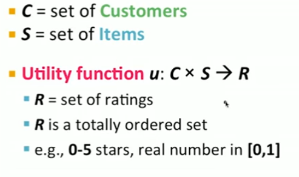
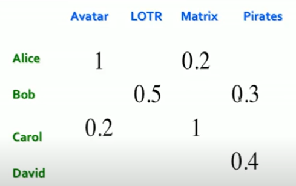
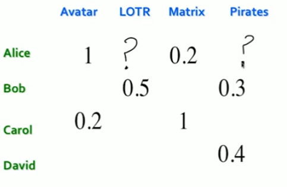
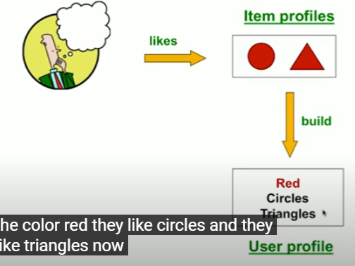
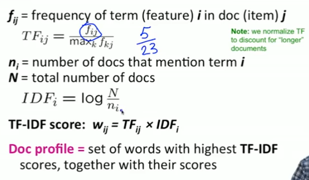

## Overview of Recommender Systems

### Formal Model

#### Utility Matrix

- 目标就是填补空白   

### Key Problems
1. Gathering "known" ratings for matrix
2. Extrapolate unkown rating from known rating
3. Evaluate Extrapolation

#### Solution
1. Explicit
   1. 直接让用户评分
   2. **Doesn't scale**: 只有一小部分人愿意写评论
2. Implicit
   1. Learning ratings from user actions (观看时间，离开时间)
   2. What about low ratings (鉴定用户不喜欢往往是很难的)

### Matrix U is sparse
- ***Cold Start***
  - new items have no ratings

## Content Base Recommendations 
- Recommend items to customer $x$ similar to **previous items rated highly** by $x$
- Examples:
  - Movies: same actors, directors, genres

### Item Profile

- thinking Item Profiles as Vectors
  - Text Features
    - Profile = {important words}
      - use TF-IDF

#### TF-IDF

$TF_{ij} = \frac{f_{ij}}{\max_k{f}_{kj}}$

### User Profile

#### Pros
- No need for data on other users
- Able to recommend otusers with unique tasts
- Able to recommned new & unpopular items
- Explanable 可解释的

#### Cons
- Finding appropriate **features** is hard
- Overspecialization
  - 过于局限于历史记录
  - 用户之前可能那个没体现出其他兴趣
- **Cold Start** for **new users**
