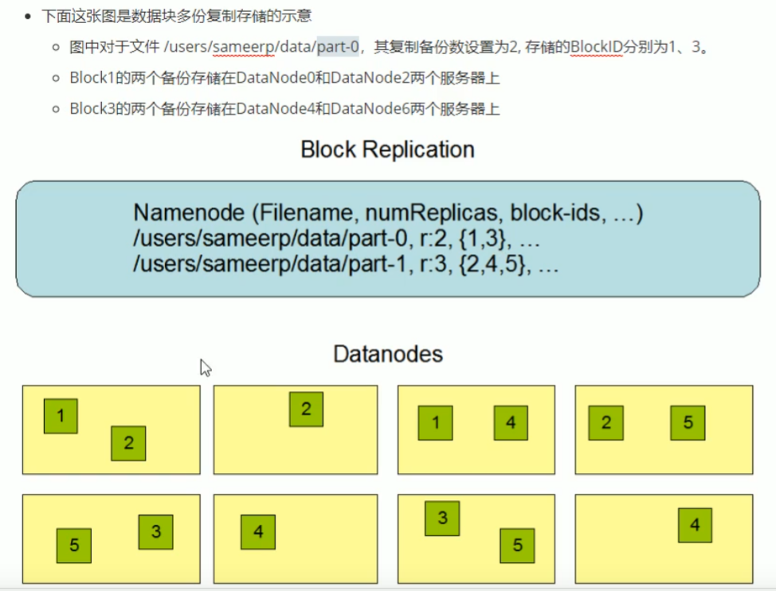
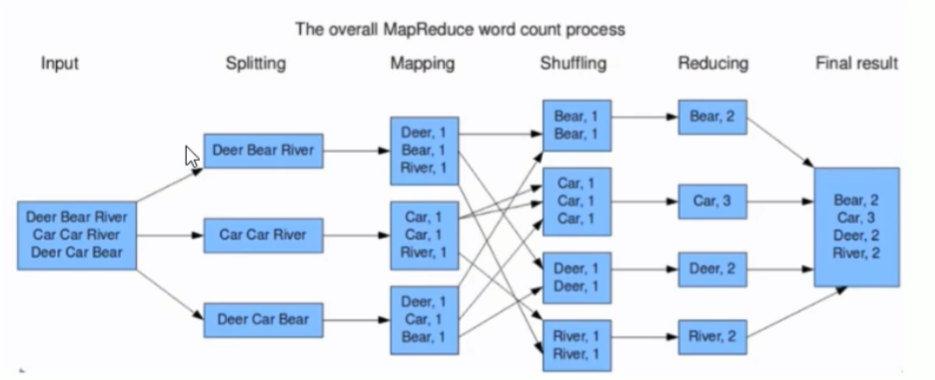
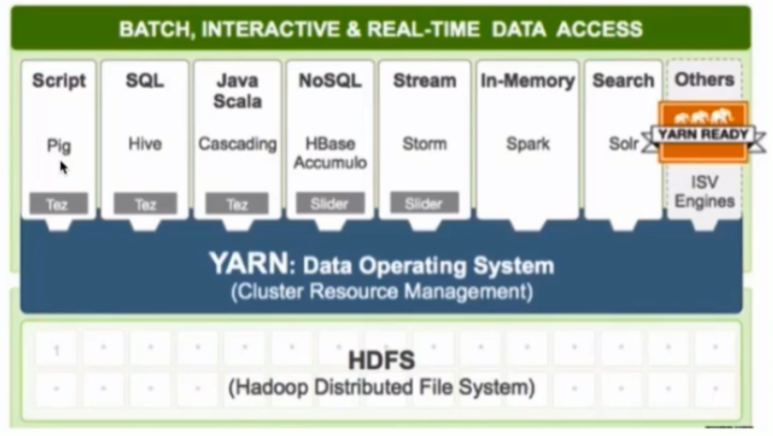

## Hadoop 
P45

### Hadoop 概念
- 分布式的计算框架 **可靠** **可扩展**
- 集群可到上万台
- 可靠
- 功能
  - 数据仓库
    - 会保存所有历史版本，只记录，很少更新/删除
  - PB级数据的存储 处理 分析 统计

### 1.2 Hadoop 核心组件
- Hadoop Common
  - 协调各组件的通用工具
- HDFS（Hadoop Distributed File System）解决分布式存储问题
  - 基于 2003年Google File System论文
  - 是GFS的开源实现
  - 扩展性 容错性 海量数据存储
  - 将文件分成固定大小的数据块
  - 在多台机器上保存多副本
  - 数据切分、多副本、容错等操作都是可见的
  - 
- Hadoop MapReduce 解决分布式计算问题 【离线计算】
  - 基于 2004年MapReduce论文
  - 扩展性 & 容错性 & 海量数据 & 离线处理
  - 两个阶段
    - Mapping 分离
    - Reducing 合并
  - 
- Hadoop YARN 资源调度系统框架
  - Yet Anoterh Resource Negotiator
  - 负责整个集群的资源管理和调度
  - 扩展性 容错性 多框架资源统一调度
  - 多个框架会同时调用HDFS上的数据，YARN进行先后顺序协调
  - 

### 1.3 Hadoop优势
- 高可靠
- 高扩展
  - 可以线性扩展集群规模
- 生态成熟