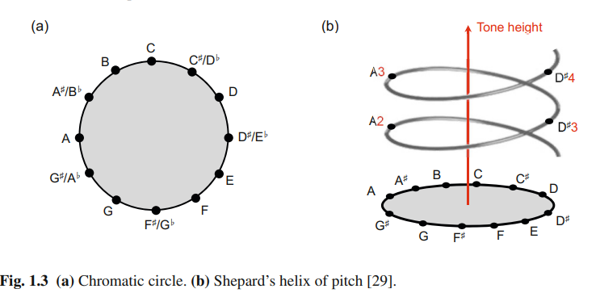

## Chapter 1 Music Representations

### 1.1 Sheet Music Representations

- **Sheet music**, also referred to as **musical score**, provides a visual representation of what we commonly refer to as the “piece of music.” 
  - A musical score is **rarely** played mechanically
    - Musicians may shape the flow of the music by varying the tempo, dynamics, and articulation,
  -  the famous “short-short-short-long" **motif**, which is commonly referred to as the “fate motif” of Beethoven’s Fifth.

#### 1.1.1 Musical Notes and Pitches
- In music, the term ***note*** is often used in a rather loose way and may refer to both 
  - a **musical symbol** (when talking about score representations) 
  - as well as a **pitched sound**
- Each **note** has several attributes that determine 
  - the relative **duration** and 
  - the **pitch** of a sound to be performed by a musician
- The notion of pitch is **not strict** and refers to a **perceptual property** that allows a listener to order a sound on a frequency related scale
- This fundamental frequency is closely related to what is meant by the pitch of a note
- Two notes with fundamental frequencies in **a ratio equal to any power of two** (e.g., half, twice, or four times) are perceived as very **similar**
  -  all notes with this kind of relation can be grouped under the same **pitch class**.
  -   the fundamental notion of an **octave**
      -   the interval between one musical note and another with **half or double** its fundamental frequency
-  a **musical scale**, which can be thought of as a finite set of representative pitches
- In this book, we only consider the case of the **twelve-tone equal-tempered scale**
  - where an octave is subdivided into **twelve scale steps**
  - The difference between the fundamental frequencies of two subsequent scale steps is also called a **semitone**, which is the smallest possible interval in this scale
- Seven of the pitch classes (corresponding to C major) are denoted by
the letters **C, D, E, F, G, A, B.**
  - These pitch classes correspond to the **white keys** of a piano keyboard
- The remaining five pitch classes correspond to the black keys of a piano keyboard and are denoted by a combination of a letter and an accidental (#, b)
  -  A sharp (#) **raises** a note by a semitone, and a flat (b) **lowers** it by a **semitone**
  -  C# D# F# G# A# (只有E B没有)
  -  Db Eb Gb Ab Bb (只有C F没有)
- the **Scientific Pitch Notation**, each note is specified by the **pitch class name**, followed by a **number** that indicates the **octave**
  - I.E The note **A4** is determined to have a fundamental frequency of **440 Hz** and serves as a reference.
- The octave number **increases** by one upon an ascension from a note with pitch **class B** to one with pitch **class C**
  - B4 → C5
- Ordering all notes of the **equal-tempered scale** according to their pitches, one obtains an **equal-tempered chromatic scale**, where all notes of the scale are equally spaced
- The term chromatic is derived from the Greek word chroma, meaning color. In the music context, the term “chroma” closely relates to the twelve different pitch classes. 

#### 1.1.2 Western Music Notation
- 五线谱 The standard Western music notation is based on a staff, which is a set of **five horizontal lines** and four spaces each representing a different musical pitch
- A staff generally begins with a **clef symbol**, which indicates the position of one particular note on the staff
  - the treble clef ( ), also known as the **G-clef**, indicates that the **second line** is the pitch **G4**
  - the bass clef ( ), also known as the **F-clef**, indicates that the **fourth line** is the pitch **F3** (see Figure 1.4c)