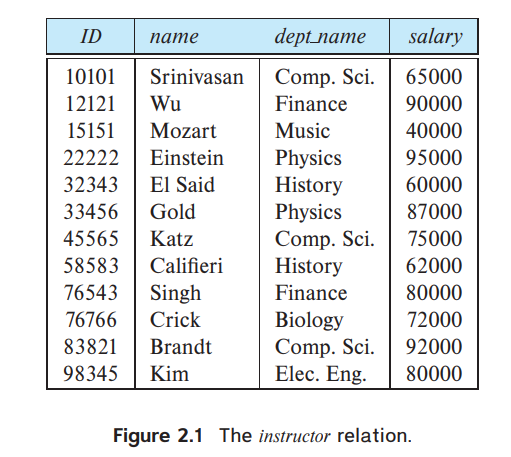
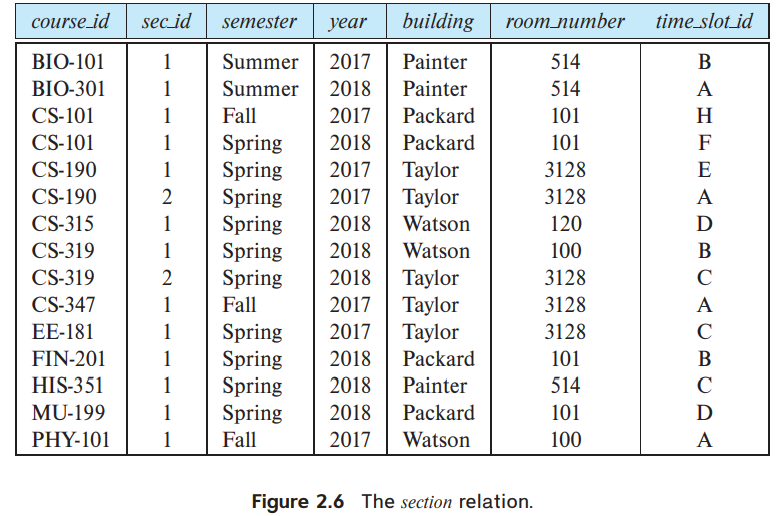
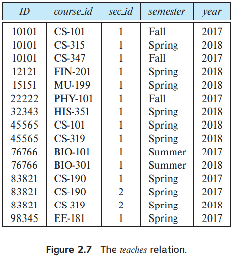
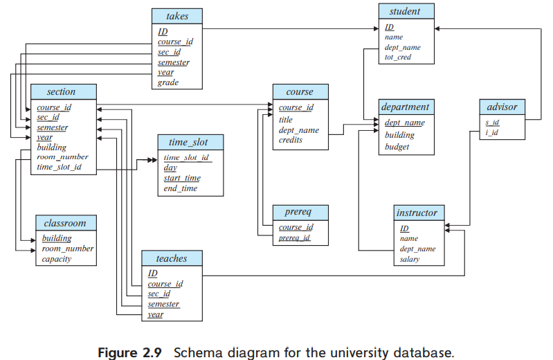
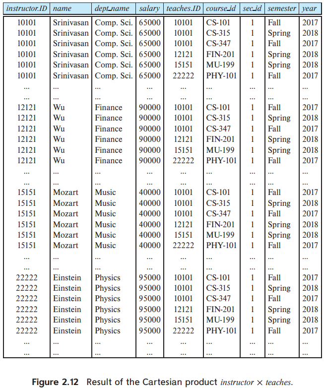

# CS-122A

## Part 1 RELATIONAL LANGUAGES

### Chapter 2. Introduction to the Relational Model
- It attained its primary position because of its simplicity
- It has retained this position by incorporating various new features and capabilities 
    - e.g object-relational feature XML

####  2.1 Structure of Relational Databases

- A relational database consists of a collection of `tables`, each of which is assigned a unique name. 
- Example `instructor` table
  - The table has four column headers: *ID*, *name*, *dept name*, and *salary*
  - Each row of this table records information about an instructor, consisting of the instructor’s *ID*, *name*, *dept name*, and *salary*.    
- In general, a **row** in a table represents a `relationship` among a set of values.
- A `relationship` between n values is represented mathematically by an **n-tuple** of values
- `relation` is used to refer to a `table`
-  `tuple` is used to refer to a `row`
-  `attribute` refers to a `column` of a `table`
-  `relation instance` to a **specific instance** of a `relation`, that is, containing **a specific set of rows**
     - The order in a relation is **irrelevant**, since a relation is a set
- `domain` of that attribute is **a set of permitted values** for each `attribute` of a `relation`
  - A domain is `atomic` if elements of the domain are considered to be **indivisible units**
    - 反例：电话号码 可以分解成区号...
- The `null value` is a special value that signifies that the value is **unknown or does not exist**.
  - null values cause a number of difficulties
  - We shall assume `null values` are **absent initially**, and in Section 3.6 we describe the effect of nulls on different operations
- 平衡 **efficiencies** 和 **flexibility** .

#### 2.2 Database Schema

- `database schema` vs. `database instance`
  - ≈ `class` vs. `object`
  - `schema` is the **logical design** of the database
  - `database instance` is a **snapshot of the data** in the database at a given instant in time
  - often use the same name, such as *instructor*, to refer to both the `schema` and the `instance`
- a `relation schema` consists of 
  - a list of `attributes` 
  - and their corresponding `domains`
- `schema`表示方法 $department (dept\_ name, building, budget)$
- EXAMPLE *section* relation 
  - $section (course\_ id, sec\_ id, semester, year,\\ building, room\_ number, time\_ slot\_ id)$
- EXAMPLE *teaches* relation 
  -  $teaches (ID, course\_ id, sec\_ id,\\ semester, year)$

#### 2.3 Keys

- `key` the `attribute values` of a tuple that can **uniquely identify** the tuple. 
- a `superkey` is a set of **one or more** `attributes` that allow us to **identify uniquely** a `tuple` in the `relation`
- 正式表达
  - let $R$ denote the set of `attributes` in the schema of `relation` $r$
  - a `subset` $K$ of $R$ is a `superkey` for $r$
    - $(t_1.K \neq t_2.K) \rightarrow (t_1\neq t_2) \\ t_1,t_2\in r$ 
- If $K$ is a `superkey`, then so is any
**superset** of $K$
  - `candidate keys` `superkeys` for which **no proper subset** is a `superkey`

##### 主键 Primary Key 
- `primary key`:  a `candidate key` that is chosen by the designer as the **principal means of identifying tuples** within a `relation`.
- A `key` (whether primary, candidate, or super) is a property of the **entire relation**, rather than of the individual tuples
- `primary keys` are also referred to as `primary key constraints`
- 正式表达
  - list the primary key attributes of a relation schema before the other attributes
  - Primary key attributes are also underlined.
  - $classroom (\underline{building}, \underline{room\_ number}, capacity)$
- The primary key should be chosen such that its attribute values are **never, or are very rarely, changed**

##### 外键 foreign-key
- A `foreign-key constraint` from **attribute(s) $A$** of **relation $r_1$** TO the **primary-key $B$** of `relation` $r_2$ states that on any database `instance`, the value of $A$ for **each tuple in $r_1$** must also be the **value of B** for **some tuple in $r_2$**
  - Attribute set $A$ is called a `foreign key` from $r_1$, referencing $r_2$.
  - $r_1$ is also called the `referencing relation` of the `foreign-key constraint`
  - $r_2$ is called the `referenced relation`.
- **MUST be the primary key** of the `referenced relation`
- a `referential integrity constraint` requires that the values appearing in specified attributes of any tuple in the referencing relation also appear in specified attributes of **at least one** tuple in the referenced relation.

#### 2.4 Schema Diagrams

- `schema diagrams` A `database schema`, along with `primary key` and `foreign-key constraints`, can be depicted by it.
  - `Primary-key attributes` are shown **underlined**
  - Foreign-key constraints appear as
arrows 
    - 外键 $\rightarrow$ 主键
- *Many database systems provide design tools with a graphical user interface for creating schema diagrams*  

#### 2.5 Relational Query Languages
- A `query language` is a language in which a `user` **requests information** from the database.
- Query languages can be categorized as 
  1. imperative, 
  2. functional, 
  3. or declarative
- In an `imperative query language`, the user instructs the system to perform a specific sequence of operations on the database to compute the desired result
- In a `functional query language`, the computation is expressed as the evaluation of functions that may operate on data in the database or on the results of other functions; 
  - functions are side-effect free, and they do not update the program state
- In a `declarative query language`, the user describes the desired information without giving a specific sequence of steps or function calls for obtaining that information
  - using some form of mathematical logic
  - It is the job of the `database system` to figure out how to obtain the desired information
- There are a number of **“pure” query languages**
  - The `relational algebra` is a `functional query language`
  - The `tuple relational calculus and domain relational calculus` in Chapter 27 are `declarative`

####  2.6 The Relational Algebra
- The relational algebra consists of a set of `operations` that 
    - take **one or two relations** as `input` and 
    - produce **a new relation** as their `result`.
- `unary operations` operate on one relation.
- `binary operations` operate on pairs of relations
- RECALL a `relation` is **a set of tuples**, relations CANNOT contain duplicate tuples, in **formal relational algebra**
  - *HOWEVER*, `tables` in database systems are permitted to contain duplicates unless a specific constraint prohibits it
- **TIME COMPLEXITY**
  - 如果要遍历所有tuple的所有attribute也是$O(n^2)$
    - 例如Project $\Pi$, Set Operations $\cup \cap -$ 

##### 2.6.1 The Select Operation $\sigma$

- The select operation **selects** tuples that satisfy a given `predicate`
  - $\sigma_{\text{PREDICATE}}(\text{RELATION})$
    - $\sigma_{dept\_ name = \text{"Physics"}}(instructor)$
      - to select those tuples of the instructor relation where the instructor is in the “Physics” department
  - allow comparisons using =, ≠, <, ≤, >, and ≥ in the selection predicate
    - $\sigma_{salary>9000}(instructor)$
  - we can combine several predicates into a larger predicate by using the connectives and (∧), or (∨), and not (¬).
    - $\sigma_{dept\_ name = \text{"Physics"}\wedge salary>9000}(instructor)$
      - find the instructors in Physics with a salary greater than $90,000
- $O(n)$

##### 2.6.2 The Project Operation $\Pi$

- The `project` operation is a **unary operation** that returns its argument relation, with certain attributes left out.
  - $\Pi_{\text{ATTRs LIST}}(\text{{RELATIONs}})$
  - The basic version of the project operator $\Pi_{L}(E)$ allows only attribute in the list $L$
  - $\Pi_{ID,name,salary/12(instructor)}$
    - get the *monthly salary* of each instructor
- $O(n^2)$
  - 需要遍历每个tuple的每个attribute

##### 2.6.3 Composition of Relational Operations

- The fact that ***the result of a relational operation is itself a relation*** is important.
- $\Pi_{name}(\sigma_{dept\_ name = \text{"Physics"}}(instructor))$
- **relational-algebra operations** can be composed together into a `relational-algebra expression`

##### 2.6.4 The Cartesian-Product Operation $\times$
- The `Cartesian-product operation`, denoted by a cross ($\times$), allows us to combine information from any two relations. 
    - $r_1 \times r_2$
      - the Cartesian product of relations $r_1$ and $r_2$ 
    - $r_1$每一行tuple都和$r_2$的每一行结合 一共有$n_1n_2$个tuple
      - many meaningless tuples
- This naming convention requires that the relations that are the arguments of the Cartesian-product operation have **distinct names**
- if we have relations $r_1(R_1)$ and $r_2(R_2)$, then $r1 × r2$ is a relation $r(R)$ whose **schema $R$** is the concatenation of the **schemas $R_1$ and $R_2$**.
- concatenates $t_1$ and $t_2$ into a single tuple
  - $r=instructor \times teaches $
- $O(n^2)$
  
##### 2.6.5 The Join Operation $\bowtie$

- The `join` operation allows us to combine a `selection` and a `Cartesian product` into a single operation.
  - $r \bowtie_\theta s = \sigma_\theta(r \times s)$ 
    - $ instructor \bowtie_{instructor.ID=teaches.ID} teaches \equiv \sigma_{instructor.ID=teaches.ID(instructor \times teaches)}$
- $O(n^2)$

##### 2.6.6 Set Operations $\cup \cap -$

- the `union` $\cup$ of these two sets; that is, we need all course ids that appear in either or both of the two relations.
  - $r_1 \cup r_2$
    - $$\Pi_{course\_ id} (\sigma_{semester =\text{“Fall”}∧ year=2017}(section)) ∪ \\
\Pi_{course\_ id}(\sigma_{semester=\text{“Spring”}∧ year=2018}(section))$$
  - `compatible` relations: for a `union` operation to make sense:
    1. ensure that the input relations to the union operation have the same number of attributes; the number of attributes of a relation is referred to as its `arity`
    2. When the attributes have associated types, the types of the $i$th attributes of both input relations must be the same, for each $i$.
- `intersection operation` $\cap$ to find tuples that are in both the input relations
  - $r \cap s$
  - NEED `compatible` relations
- `set-difference operation` $−$ to find tuples that are in one relation but are not in another
  - $r - s$
  - NEED `compatible` relations
- ALL NEED `compatible` relations
- ALL $O(n^2)$

##### 2.6.7 The Assignment Operation $\leftarrow$

- The `assignment operation` $\leftarrow$ like assignment in a programming language
- With the assignment operation, a query can be written as a sequential program consisting of a series of assignments followed by an expression whose value is displayed as the result of the query

##### 2.6.8 The Rename Operation $\rho$

-  the `rename operator` $\rho$ 
   -  $\rho_x(E)$ 
      -  returns the `result` of **expression $E$** under the **name $x$**
- A relation r by itself is considered a (trivial) relational-algebra expression. Thus, we can also apply the rename operation to a relation r to get the same relation under a new name
- $$\rho_{x(A_1,A_2,\dots.A_n)}(E)$$
  - returns the result of expression $E$ under the name $x$, and with the attributes renamed to $A_1, A_2, …, A_n$
- ` positional notation` for attributes 写成 `$1,$2,$3`

##### 2.6.9 Equivalent Queries
- there is **often more than one way** to write a query in relational algebra
- `equivalent` that is, they give **the same result** on any database.
- `Query optimizers` in database systems typically look at what result an expression computes and find an **efficient way of computing that result**, rather than following the exact sequence of steps specified in the query.

#####  OTHER RELATIONAL OPERATIONS
1. The `aggregation operation` allows a `function` to be computed over the set of values returned by a query
     - `average, sum, min, and max `
2. `natural join` replaces the predicate $θ$ in $⋈θ$ with an **implicit predicate** that requires **equality over those attributes that appear in the schemas of both the left and right relations**
   1. The `outer join` operation allows for the retention of such tuples in the result by inserting nulls for the missing values

#### Definitions
- `tables`