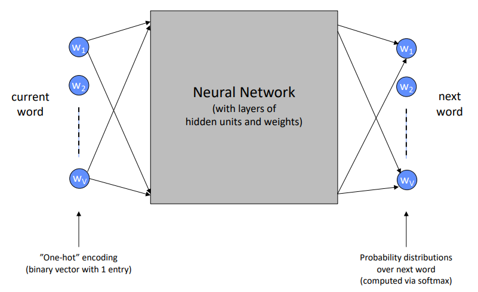

# CS-175

## Week 02 Lecture 3

### Logistic Learning
- Logistic/Sigmoid Function e.g $\frac{1}{e^{-z}}$
- use Negative Log $-\sum{\log{P(c_i|x_i,w)}}$
- What is Gradient
- Convexity and Non-Convexity
- Weight Regularization

#### Summary
- Network is a series of “layers”
- Each layer does the following: $$h_{L+1}=g(W_L h_L)$$
  - $h_{L+1}$ : Activation vector at `Layer[L+1]`
  - $g(x)$: non-linearity (ReLU/Softmax)
  - $W_L$: weight matrix at `Layer[L] e.g 50*100` 
  - $h_L$ Activation vector at `Layer[L] e.g 100*1`
  - $h$ vectors (activations) are internal representations learned by the model
  - Output layer is a `softmax` layer, producing K probabilities that sum to `1`
    - One probability per class k, $P(C =k | x ), x = \text{input feature vector}$

### Trainning Neural
- SGD Stochastic Gradient Descent

### Language Models for Word Sequences
- A model that can generate P( word i | history up to word i) is a Language Model
- EXAMPLE: `The capital of Japan is < WORD >`
```Python
[{'prob': 0.332,
'sequence': 'the capital of japan is tokyo',
'token': 5522,
'token_str': 'tokyo’},
{'prob': 0.137,
'sequence': 'the capital of japan is osaka',
'token': 13000,
'token_str': 'osaka’},
{'prob': 0.119,
'sequence': 'the capital of japan is kyoto',
'token': 15008,
'token_str': 'kyoto'},]
```
- Language models can be learned from any source of text, e.g.

#### Markov Chain/N-gram Language Models
- Consider the sequence “the dog jumped over the…”
  - To predict what words might come next the Language Model needs $P( \text{\$[WORD]} | \text{the, dog, jumped, over, the} )$

#### Neural Language Models
- Key ideas: 
  - learn “embeddings” of words (so the model can generalize to combinations it did not see)
  - use a more flexible representation of memory than N-grams

#### Simulating/Generating Words from a Language Model 
Say we have already seen the partial sequence "The dog jumped … "

- Procedure
  1.  Use the language model to compute P(word i | the, dog, jumped)
      - Say, the word “over” has the highest probability
      - and we select it  
  2.  Now our sequence is “The dog jumped over…” Now use the language model to compute P(word i | the, dog, jumped, ***over***)


### Recurrent Neural Networks RNN
- BOW as **Input**
  - Inputs could also be “bag of words”
  - One input per term in the vocabulary
  - Very large weight matrix 
    - (number of terms by number of hidden units)
- **Learning** to Predict the Next Word given Current Word 
- **Predicting** Next Word with Neural Networks
  - Traitional *(does not track)* 
  - **RNN (track the previous records)** 


- “Unrolling” a Recurrent Network
  - The hidden layer in an RNN is keeping track of the “state” of the sequence
  - RNN hidden layer的最后一层有整句的信息 
  - we can use the hidden states as `features` to classify the whole sequence
    - and this broadens the scope of what we can use RNNs for 
