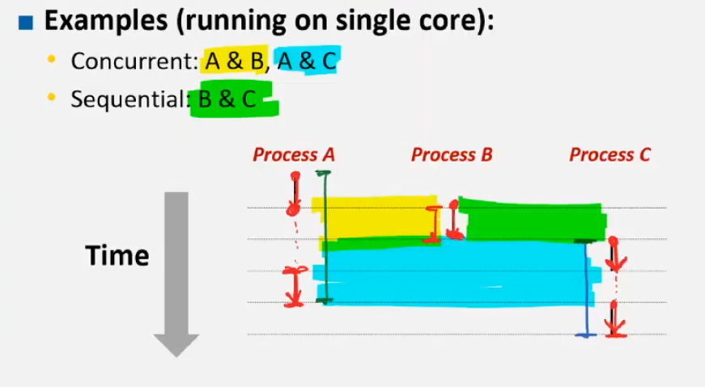
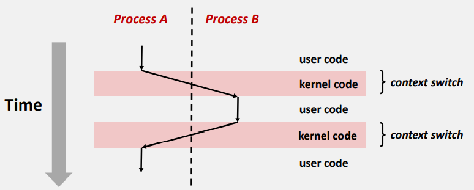
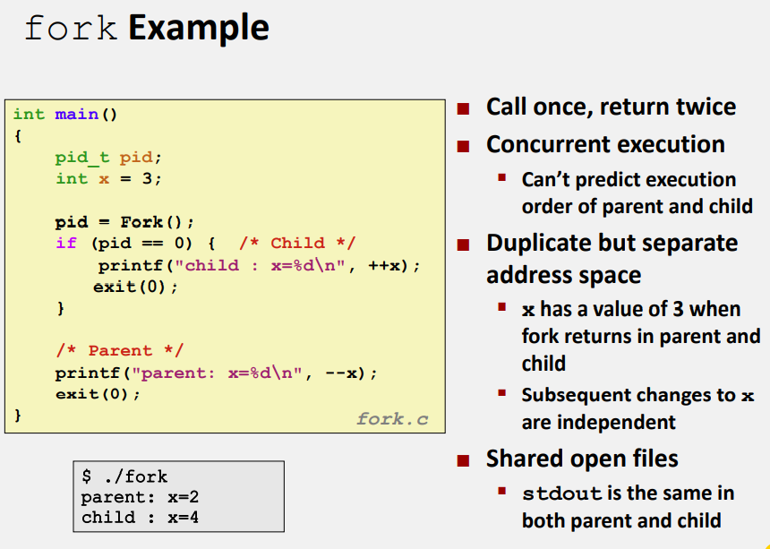
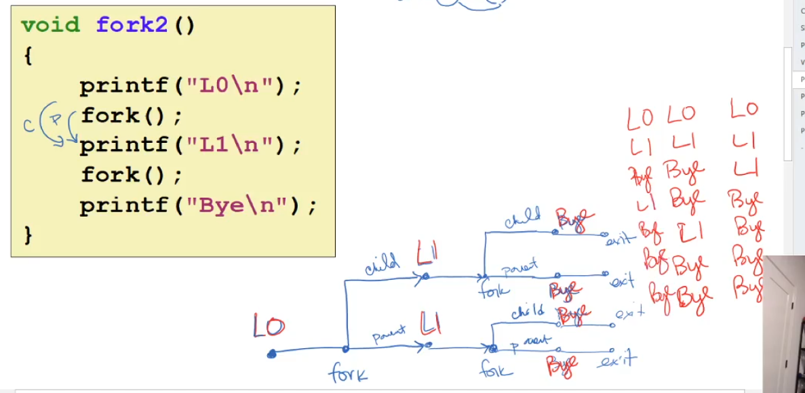
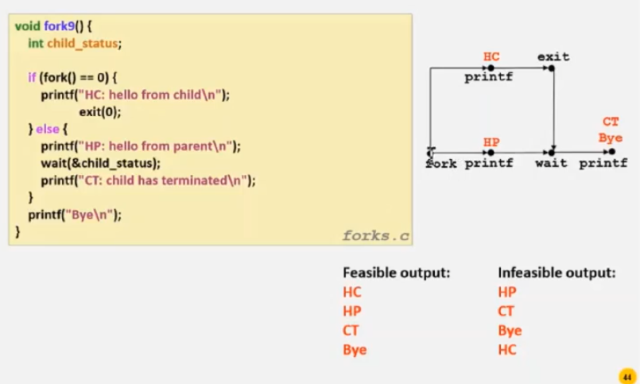
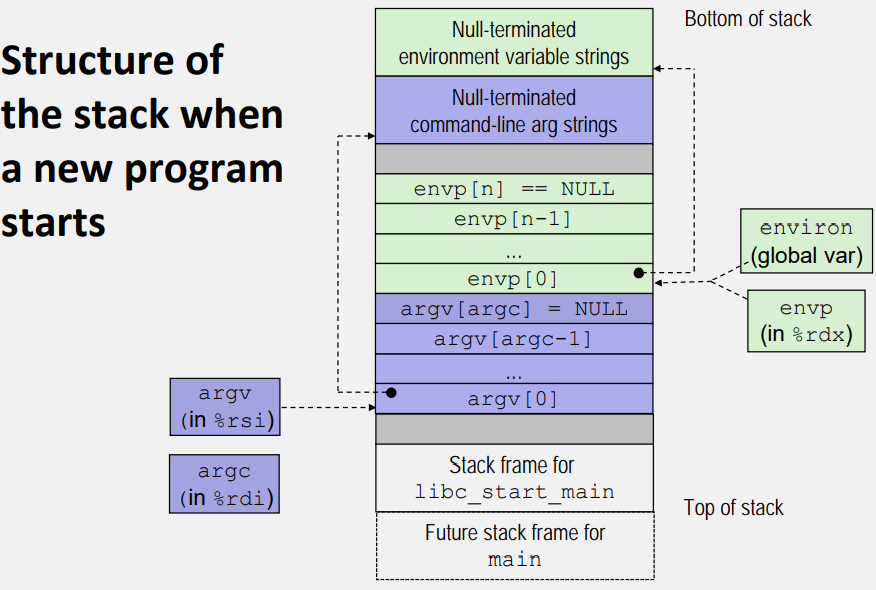

# ICS-53

## Exception

### Control Flow
- Processors do only `CPU’s control flow (or flow of control)`
  - From startup to shutdown, a CPU simply reads and executes (interprets) a sequence of `instructions`, one at a time

#### Altering the Control Flow
- Up to now: two mechanisms for changing control flow:
    - Jumps and branches
    - Call and return
  - Both react to changes in **program state**
- **Insufficient** : Difficult to react to changes in **system state**:
    - Data arrives from a disk or a network adapter
    - Instruction divides by zero
    - User hits Ctrl-C at the keyboard
    - System timer expires
- System needs mechanisms for “**exceptional control flow**”

#### Exceptional Control Flow
- Exists at all levels of a computer system
- Low level mechanisms
  1. Exceptions 
- Higher level mechanisms
  1. Process context switch
    o Implemented by OS software and hardware timer
  3. Signals
    o Implemented by OS software 
  4. Nonlocal jumps: setjmp() and longjmp()
    o Implemented by C runtime library

### Exception
-  An exception is **a transfer of control to the OS kernel** in response to some event (i.e., change in processor state)
   -  **Kernel is the memory-resident part of the OS**

#### Asynchronous Exceptions (Interrupts)
- Caused by events external to the processor
  - EXAMPLE Timer interrupt
  - EXAMPLE I/O Interrupt

#### Synchronous Exceptions
- Caused by events that occur as a result of executing an 
`instruction`
  1. **Traps**
    - **Intentional and Always Recoverable**
    - Examples: system calls, breakpoint traps, special instructions
    - Returns control to “next” instruction
  2. **Faults**
    - **Unintentional but possibly recoverable** 
    - Examples: page faults (recoverable), protection faults (unrecoverable), floating point exceptions
    - Either re-executes faulting (“current”) instruction or aborts
  3. **Aborts**
    - **Unintentional and unrecoverable**
    - Examples: illegal instruction, parity error, machine check
    - Aborts current program


### Process
- Definition: A **process** is an instance of a running program.
- `Process` provides each `program` with two key abstractions:
    1. Logical control flow
       - Provided by kernel mechanism called **context switching**
       - hide **CPU Usage**
    2. Private address space
       - Provided by kernel mechanism called **virtual memory**
       - hide **Memory Usage**
- Computer runs many processes simultaneously
- Single processor executes multiple processes **concurrently**
    - Process executions interleaved (multitasking) 
    - Address spaces managed by virtual memory system (later in course)
    - Register values for non-executing processes saved in memory
- Multicore processors
    - Multiple CPUs on single chip
    - Share main memory (and some of the 
    caches)
    - Each can execute a separate process
    o Scheduling of processes onto cores 
    done by kernel

#### Processes States
1. Running
   - Process is either executing, or waiting to be executed and will **eventually be scheduled** by the kernel
2. Stopped
   - Process execution is **suspended** and will not be scheduled *until further notice*
3. Terminated
   - Process is **stopped permanently**

#### Concurrent Processes
- Each process is a logical control flow
- Sequential VS. Concurrenty
  - Two processes run **concurrently** (are concurrent) if their flows overlap in time
    - Control flows for concurrent processes are **physically disjoint** in time
    - However, can think of them as **running in parallel** with each other
  - Otherwise, they are **sequential**


#### Context Switching
- Processes are managed by a shared chunk of memory-resident OS code called the **kernel**
  -  the kernel is **not a separate process**, 
  -  but rather runs as part of some existing process.
- Control flow passes from one process to another via a `context switch`


#### System Call Error Handling
- On error, Unix system-level functions typically return -1 and set global variable `errno` to indicate cause.

#### Creating Process
-  Parent process creates a new running child process by calling `fork`
   -  `int fork(void)`
      -  `Returns` (on the line of `fork` calling)
         -  0 to the child process
         -  child’s PID to parent process
         -  `int a=fork()` will have `a=0` in child and `a=pid` in parent;
    - Child is ***almost*** identical to parent:
      - Child get an identical (but separate) copy of the parent’s virtual address space.
      -  Child gets identical copies of the parent’s open file descriptors (Both can R/W same file)
      - Child has a different PID than the parent
  -  **called once but returns twice**
  -  `schedule` controls the **sequence** of child/parent processes  

##### Fork Bomb
```C
int main(){
    while(1){
        fork();
    }
}
```
- 系统甚至不会响应I/O输入（Ctrl+C），因为一直集中精力`fork`

#### Terminating Processes
- Process becomes terminated for one of three reasons:
   1. Receiving a signal whose default action is to terminate 
   2.  Returning from the main routine
   3.   Calling the exit function
- `void exit(int status)`
  - Terminates with an exit status of status
  - *Convention*: normal return status is 0, nonzero on error
  - **called once but never returns.**

##### Zombie Child
- Child process still active even though 
parent has terminated
    -  Must kill child explicitly, or else will keep running indefinitely

#### wait: Synchronizing with Children
- Parent reaps a child by calling the wait function
  - CAN ONLY terminate after child is terminated
- `int wait(int *child_status`
  - Suspends current process until one of its children terminates
  - Return value is the pid of the child process that terminated
  - If `child_status != NULL`, then the integer it points to will be set to a value that indicates reason the child terminated and the exit status:
    - o Checked using macros defined in wait.h
`WIFEXITED, WEXITSTATIS, WIFSIGNALED, WTERMSIG, 
    WIFSTOPPED, WSTOPSIG, WIFCONTINUED
`



#### execve: Loading and Running Programs
- `int execve(char *filename, char *argv[], char *envp[])`
- Loads and runs in the current process:
  - `filename` Executable file 
  - `argv` with argument list argv
    - By convention `argv[0]==filename`
  - `envp` environment variable list
    - “name=value” strings (e.g., USER=droh)
    - `getenv, putenv, printenv`
- Overwrites code, data, and stack
  - Retains PID, open files and signal context
- **Called once and never returns**
  - **except if there is an error**
  - `execve(a,b,c)<0`

##### Structure of the stack when a new program starts
- cmd-line args/ envp should never be overwritten, becuz they are above stack of `main`



#### Obtaining Process IDs
- `pid_t getpid(void)`
  - Returns PID of current process
- `pid_t getppid(void)`
  - Returns PID of parent process

